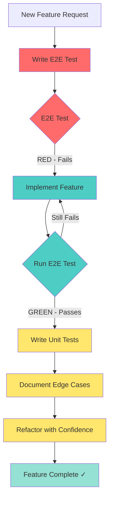

# Testing Strategy - E2E-First TDD with Test-After Unit Tests

## Overview

This document outlines Omnera's testing strategy: **E2E-First TDD with Test-After Unit Tests**. This hybrid approach uses E2E tests as executable specifications (written before implementation) and unit tests as implementation documentation (written after). The strategy follows **F.I.R.S.T principles** (Fast, Isolated, Repeatable, Self-validating, Timely) and **Given-When-Then structure** for both test types.

## Testing Approach

Omnera uses a **dual-timing strategy** that optimizes for both feature clarity and implementation quality:

**E2E Tests (TDD - Test-Driven Development)**:

- Write E2E tests **BEFORE** implementing features
- E2E tests serve as **executable specifications** defining feature completion
- Prevents scope creep and over-engineering
- Ensures critical user workflows are verified end-to-end

**Unit Tests (Test-After Development)**:

- Write unit tests **AFTER** implementing features
- Unit tests document the actual solution and implementation details
- Provide fast feedback for refactoring and edge cases
- Cover internal logic, error paths, and boundary conditions

**Why This Hybrid Approach?**

1. **E2E-First** ensures you're building the right thing (defines "what works" from user perspective)
2. **Unit-After** ensures you built it right (documents "how it works" internally)
3. **Confidence Distribution**: E2E verifies critical paths work end-to-end; unit tests enable fearless refactoring
4. **Development Flow**: E2E test → Implement until E2E passes → Add unit test coverage

**Visual Workflow**:



**Example Workflow**:

```bash
# 1. Write E2E test (TDD - defines requirements)
tests/features/table-creation.spec.ts  # Failing test

# 2. Implement feature until E2E passes
src/domain/models/app/tables.ts        # Schema
src/application/table-service.ts       # Use case
src/presentation/routes/tables.ts      # API

# 3. Run E2E test
bun test:e2e  # Should pass now

# 4. Add unit test coverage (test-after)
src/domain/models/app/tables.test.ts   # Schema validation
src/application/table-service.test.ts  # Business logic edge cases
```

## Managing Red Tests with `.fixme`

When writing E2E tests BEFORE implementation (RED phase of TDD), use Playwright's `.fixme` modifier to mark tests as known failures. This allows the test suite to pass in CI while documenting unimplemented features.

### Why Use `.fixme`?

- ✅ **CI stays green**: Tests don't fail the build while features are in development
- ✅ **Documents intent**: Clearly shows which features are planned but not yet implemented
- ✅ **Tracks progress**: Easy to see what needs to be done
- ✅ **Prevents forgetting**: Tests are written and committed, just marked as incomplete

### Usage Pattern

**Step 1: Write RED test with `.fixme`**

```typescript
import { test, expect } from '@playwright/test'

// Mark as fixme during RED phase
test.fixme('should display version badge when app has version', async ({ page }) => {
  // Given: An app with version
  await page.goto('/')

  // When: Page loads
  // Then: Version badge should be visible
  await expect(page.locator('[data-testid="app-version-badge"]')).toBeVisible()
  await expect(page.locator('[data-testid="app-version-badge"]')).toHaveText('1.0.0')
})
```

**Step 2: Implement feature (GREEN phase)**

```typescript
// src/presentation/components/DefaultHomePage.tsx
export function DefaultHomePage({ app }: { readonly app: App }) {
  return (
    <html>
      {/* ... */}
      {app.version && (
        <Badge data-testid="app-version-badge">{app.version}</Badge>
      )}
    </html>
  )
}
```

**Step 3: Remove `.fixme` when implementation is complete**

```typescript
// Remove .fixme - test should now pass
test('should display version badge when app has version', async ({ page }) => {
  // Given: An app with version
  await page.goto('/')

  // When: Page loads
  // Then: Version badge should be visible
  await expect(page.locator('[data-testid="app-version-badge"]')).toBeVisible()
  await expect(page.locator('[data-testid="app-version-badge"]')).toHaveText('1.0.0')
})
```

### `.fixme` vs `.skip`

| Modifier     | Purpose                    | When to Use                                                  |
| ------------ | -------------------------- | ------------------------------------------------------------ |
| **`.fixme`** | Known failure, planned fix | RED tests during TDD - feature not yet implemented           |
| **`.skip`**  | Temporarily disabled       | Flaky tests, environment-specific issues, temporary problems |

**Example:**

```typescript
// ✅ GOOD - Use .fixme for unimplemented features (TDD RED phase)
test.fixme('should send email notification on user signup', async ({ page }) => {
  // Test defines feature completion criteria
  // Implementation coming soon
})

// ✅ GOOD - Use .skip for temporarily broken tests
test.skip('should handle edge case X', async ({ page }) => {
  // Known issue #123 - will fix when library updates
})

// ❌ BAD - Don't commit .skip for unimplemented features
test.skip('should display user profile', async ({ page }) => {
  // This should be .fixme instead
})
```

### Best Practices

1. **Always add a comment** explaining why `.fixme` is used:

   ```typescript
   // FIXME: Implement version badge display (see: tests/app/version.spec.ts)
   test.fixme('should display version badge', async ({ page }) => {
     // ...
   })
   ```

2. **Link to related issue or task:**

   ```typescript
   // FIXME: #456 - Add version badge to DefaultHomePage
   test.fixme('should display version badge', async ({ page }) => {
     // ...
   })
   ```

3. **Remove `.fixme` as soon as implementation is done:**
   - Don't let `.fixme` tests accumulate
   - Remove during GREEN phase of TDD cycle
   - Verify test passes before removing modifier

4. **Track `.fixme` tests in reviews:**
   - Code reviews should check for new `.fixme` tests
   - Ensure there's a plan to implement the feature
   - Don't let `.fixme` tests become permanent

### Playwright Test Status

When using `.fixme`, Playwright reports the test status as:

```
✓ should display version badge [fixme]
```

This indicates the test exists but is intentionally skipped due to missing implementation.

## Quick Reference: When to Write Tests

| Test Type      | Timing             | Purpose                                | Location           | Tool       |
| -------------- | ------------------ | -------------------------------------- | ------------------ | ---------- |
| **E2E Tests**  | BEFORE (TDD)       | Define feature completion criteria     | `tests/*.spec.ts`  | Playwright |
| **Unit Tests** | AFTER (Test-After) | Document implementation and edge cases | `src/**/*.test.ts` | Bun Test   |

**Development Flow**: E2E Test (RED) → Implement (GREEN) → Unit Tests (REFACTOR) → Done

## Test File Naming Convention

**Recommended convention for clarity and consistency**:

| Test Type      | Extension  | Location               | Example                  |
| -------------- | ---------- | ---------------------- | ------------------------ |
| **Unit Tests** | `.test.ts` | Co-located with source | `src/calculator.test.ts` |
| **E2E Tests**  | `.spec.ts` | `tests/` directory     | `tests/login.spec.ts`    |

**Why this convention**:

- **Clear Separation**: `.test.ts` = unit, `.spec.ts` = E2E (visual distinction)
- **Tool Compatibility**: Bun recognizes both, Playwright defaults to `.spec.ts`
- **Industry Standard**: Matches patterns used by Jest, Vitest, Playwright
- **Searchability**: Easy to find all unit tests (`**/*.test.ts`) or E2E tests (`tests/**/*.spec.ts`)

**See also**: [Bun Test Documentation](../infrastructure/testing/bun-test.md#test-file-naming-convention) for tool-specific details.

## Testing Principles

### F.I.R.S.T Principles

The F.I.R.S.T principles ensure tests are reliable, maintainable, and valuable, regardless of when they're written (E2E first or unit after):

#### 1. Fast

**Unit Tests (Bun)**: Tests should execute in milliseconds

- ✅ Test pure functions without external dependencies
- ✅ Mock external services (databases, APIs, file system)
- ✅ Run in parallel by default (Bun's built-in behavior)
- ✅ Use `bun test --watch` for instant feedback during development
- ❌ Avoid actual network calls, database queries, or file I/O

**E2E Tests (Playwright)**: Tests should complete in seconds, not minutes

- ✅ Run tests in parallel across multiple workers
- ✅ Use network interception to mock slow API responses
- ✅ Focus on critical user paths (not exhaustive scenarios)
- ✅ Limit test scope to essential workflows
- ❌ Avoid testing every edge case in E2E (use unit tests instead)

**Example - Fast Unit Test:**

```typescript
// ✅ GOOD - Fast (pure function, no I/O)
import { test, expect } from 'bun:test'
import { calculateTotal } from './calculator'

test('should calculate order total', () => {
  const result = calculateTotal([10, 20, 30])
  expect(result).toBe(60)
})

// ❌ BAD - Slow (makes actual API call)
test('should fetch user data', async () => {
  const user = await fetch('https://api.example.com/users/1').then((r) => r.json())
  expect(user.name).toBe('Alice')
})
```

**Example - Fast E2E Test:**

```typescript
// ✅ GOOD - Fast (mocks slow API)
import { test, expect } from '@playwright/test'

test('should display user profile', async ({ page }) => {
  await page.route('**/api/user', (route) => {
    route.fulfill({
      status: 200,
      body: JSON.stringify({ name: 'Alice', email: 'alice@example.com' }),
    })
  })

  await page.goto('/profile')
  await expect(page.locator('h1')).toHaveText('Alice')
})

// ❌ BAD - Slow (waits for real API, multiple page loads)
test('should complete full checkout flow', async ({ page }) => {
  await page.goto('/products')
  await page.waitForTimeout(5000) // Arbitrary wait
  // ... multiple slow steps
})
```

#### 2. Isolated / Independent

**Unit Tests (Bun)**: Each test should be completely independent

- ✅ Use `beforeEach` for test setup (creates fresh state)
- ✅ Avoid shared mutable state between tests
- ✅ Clean up after tests (use `afterEach` for cleanup)
- ✅ Tests can run in any order without affecting each other
- ❌ Never rely on test execution order

**E2E Tests (Playwright)**: Each test should run in isolation

- ✅ Use separate browser contexts for each test
- ✅ Clear cookies/storage before tests (`test.beforeEach`)
- ✅ Each test creates its own test data
- ✅ Tests don't depend on data from previous tests
- ❌ Never share state across tests

**Example - Isolated Unit Tests:**

```typescript
import { test, expect, beforeEach } from 'bun:test'

// ✅ GOOD - Isolated (fresh state in beforeEach)
describe('Cart', () => {
  let cart: Cart

  beforeEach(() => {
    cart = new Cart() // Fresh cart for each test
  })

  test('should add item to cart', () => {
    cart.addItem({ id: 1, name: 'Widget', price: 10 })
    expect(cart.items).toHaveLength(1)
  })

  test('should calculate cart total', () => {
    cart.addItem({ id: 1, name: 'Widget', price: 10 })
    cart.addItem({ id: 2, name: 'Gadget', price: 20 })
    expect(cart.total()).toBe(30)
  })
})

// ❌ BAD - Not isolated (shared state)
let sharedCart = new Cart() // Shared across tests

test('should add item', () => {
  sharedCart.addItem({ id: 1, name: 'Widget', price: 10 })
  expect(sharedCart.items).toHaveLength(1) // Passes first time
})

test('should calculate total', () => {
  expect(sharedCart.items).toHaveLength(0) // Fails - cart has item from previous test!
})
```

**Example - Isolated E2E Tests:**

```typescript
import { test, expect } from '@playwright/test'

// ✅ GOOD - Isolated (each test creates its own user)
test('user can create account', async ({ page }) => {
  const uniqueEmail = `user-${Date.now()}@example.com`

  await page.goto('/register')
  await page.fill('[name="email"]', uniqueEmail)
  await page.fill('[name="password"]', 'password123')
  await page.click('button[type="submit"]')

  await expect(page).toHaveURL('/dashboard')
})

test('user can login', async ({ page }) => {
  // Creates its own user, doesn't rely on previous test
  const uniqueEmail = `user-${Date.now()}@example.com`

  // Setup: Create user via API
  await page.request.post('/api/users', {
    data: { email: uniqueEmail, password: 'password123' },
  })

  await page.goto('/login')
  await page.fill('[name="email"]', uniqueEmail)
  await page.fill('[name="password"]', 'password123')
  await page.click('button[type="submit"]')

  await expect(page).toHaveURL('/dashboard')
})

// ❌ BAD - Not isolated (depends on previous test)
const testUser = { email: 'test@example.com', password: 'password123' }

test('create user', async ({ page }) => {
  await page.goto('/register')
  await page.fill('[name="email"]', testUser.email)
  await page.fill('[name="password"]', testUser.password)
  await page.click('button[type="submit"]')
})

test('login user', async ({ page }) => {
  // Assumes user from previous test exists - will fail if tests run in different order
  await page.goto('/login')
  await page.fill('[name="email"]', testUser.email)
  await page.fill('[name="password"]', testUser.password)
  await page.click('button[type="submit"]')
})
```

#### 3. Repeatable

**Unit Tests (Bun)**: Same input always produces same output

- ✅ Use deterministic data (no random values, fixed dates)
- ✅ Mock time-dependent functions (`Date.now()`, `Math.random()`)
- ✅ Mock external dependencies with predictable responses
- ✅ Tests pass consistently in any environment
- ❌ Never rely on external services, system time, or random data

**E2E Tests (Playwright)**: Tests produce consistent results

- ✅ Use deterministic test data (fixed users, products, dates)
- ✅ Mock time-sensitive operations (e.g., authentication tokens)
- ✅ Use `page.route()` to mock unreliable external APIs
- ✅ Handle timing issues with Playwright's auto-wait
- ❌ Never depend on real-time data or live APIs

**Example - Repeatable Unit Test:**

```typescript
import { test, expect, mock, spyOn } from 'bun:test'

// ✅ GOOD - Repeatable (mocked Date with Bun's spyOn)
test('should generate expiration date 30 days from now', () => {
  const mockDate = new Date('2025-01-15T00:00:00Z')
  const dateSpy = spyOn(Date, 'now').mockReturnValue(mockDate.getTime())

  const result = generateExpirationDate()
  expect(result).toBe('2025-02-14T00:00:00Z')

  dateSpy.mockRestore() // Restore original Date.now
})

// ❌ BAD - Not repeatable (uses real time)
test('should generate expiration date', () => {
  const result = generateExpirationDate()
  // This assertion will fail tomorrow!
  expect(result).toBe('2025-02-15T00:00:00Z')
})

// ✅ GOOD - Repeatable (fixed random seed with Bun's spyOn)
test('should generate random ID', () => {
  const randomSpy = spyOn(Math, 'random').mockReturnValue(0.5)

  const result = generateId()
  expect(result).toBe('ID_50000')

  randomSpy.mockRestore() // Restore original Math.random
})

// ❌ BAD - Not repeatable (actual random)
test('should generate random ID', () => {
  const result = generateId()
  expect(result).toMatch(/ID_\d{5}/) // Weak assertion, hides randomness issue
})
```

**Example - Repeatable E2E Test:**

```typescript
import { test, expect } from '@playwright/test'

// ✅ GOOD - Repeatable (mocked API with fixed data)
test('should display product details', async ({ page }) => {
  await page.route('**/api/products/1', (route) => {
    route.fulfill({
      status: 200,
      body: JSON.stringify({
        id: 1,
        name: 'Test Product',
        price: 29.99,
        stock: 10,
      }),
    })
  })

  await page.goto('/products/1')
  await expect(page.locator('h1')).toHaveText('Test Product')
  await expect(page.locator('.price')).toHaveText('$29.99')
})

// ❌ BAD - Not repeatable (depends on live API data)
test('should display latest products', async ({ page }) => {
  await page.goto('/products/latest')

  // Fails when API changes, product inventory fluctuates, or API is down
  await expect(page.locator('.product').first()).toHaveText('Widget 2000')
})

// ✅ GOOD - Repeatable (fixed date for time-sensitive data)
test('should display promotion banner', async ({ page, context }) => {
  // Mock system time to ensure promotion is active
  await context.addInitScript(() => {
    Date.now = () => new Date('2025-01-15T12:00:00Z').getTime()
  })

  await page.goto('/')
  await expect(page.locator('.promotion-banner')).toBeVisible()
  await expect(page.locator('.promotion-banner')).toHaveText('50% Off Sale - Limited Time!')
})

// ❌ BAD - Not repeatable (depends on actual date)
test('should display promotion banner', async ({ page }) => {
  await page.goto('/')
  // Passes during promotion, fails after promotion ends
  await expect(page.locator('.promotion-banner')).toBeVisible()
})
```

#### 4. Self-Validating

**Unit Tests (Bun)**: Tests determine pass/fail automatically

- ✅ Use explicit assertions (`expect().toBe()`, `expect().toThrow()`)
- ✅ Test produces boolean output (pass or fail)
- ✅ No manual inspection of logs or output required
- ✅ Clear error messages when tests fail
- ❌ Never require manual verification of results

**E2E Tests (Playwright)**: Tests validate expected outcomes

- ✅ Use Playwright assertions (`expect(locator).toHaveText()`)
- ✅ Verify UI state changes automatically
- ✅ Check URLs, element visibility, text content
- ✅ No manual clicks or visual inspection needed
- ❌ Never rely on screenshots for validation (use assertions)

**Example - Self-Validating Unit Test:**

```typescript
import { test, expect } from 'bun:test'

// ✅ GOOD - Self-validating (explicit assertions)
test('should validate email format', () => {
  const validEmail = 'user@example.com'
  const invalidEmail = 'invalid-email'

  expect(isValidEmail(validEmail)).toBe(true)
  expect(isValidEmail(invalidEmail)).toBe(false)
})

// ❌ BAD - Not self-validating (requires manual inspection)
test('should validate email format', () => {
  const result = isValidEmail('user@example.com')
  console.log('Validation result:', result) // Need to manually check console
})

// ✅ GOOD - Self-validating (tests error handling)
test('should throw error for invalid input', () => {
  expect(() => {
    processPayment({ amount: -100 })
  }).toThrow('Amount must be positive')
})

// ❌ BAD - Not self-validating (catches error but doesn't validate it)
test('should handle invalid input', () => {
  try {
    processPayment({ amount: -100 })
  } catch (error) {
    console.log('Error occurred:', error) // Manual inspection required
  }
})
```

**Example - Self-Validating E2E Test:**

```typescript
import { test, expect } from '@playwright/test'

// ✅ GOOD - Self-validating (assertions verify state)
test('should submit contact form', async ({ page }) => {
  await page.goto('/contact')

  await page.fill('[name="name"]', 'John Doe')
  await page.fill('[name="email"]', 'john@example.com')
  await page.fill('[name="message"]', 'Hello!')
  await page.click('button[type="submit"]')

  // Explicit assertions
  await expect(page.locator('.success-message')).toBeVisible()
  await expect(page.locator('.success-message')).toHaveText('Thank you for contacting us!')
  await expect(page).toHaveURL('/contact/success')
})

// ❌ BAD - Not self-validating (no assertions)
test('should submit contact form', async ({ page }) => {
  await page.goto('/contact')

  await page.fill('[name="name"]', 'John Doe')
  await page.fill('[name="email"]', 'john@example.com')
  await page.fill('[name="message"]', 'Hello!')
  await page.click('button[type="submit"]')

  // No assertions - requires manual verification
  await page.screenshot({ path: 'contact-form-result.png' })
})

// ✅ GOOD - Self-validating (validates multiple states)
test('should display validation errors', async ({ page }) => {
  await page.goto('/register')

  // Submit empty form
  await page.click('button[type="submit"]')

  // Assertions verify error state
  await expect(page.locator('.error-email')).toBeVisible()
  await expect(page.locator('.error-email')).toHaveText('Email is required')
  await expect(page.locator('.error-password')).toBeVisible()
  await expect(page.locator('.error-password')).toHaveText('Password is required')

  // Verify form not submitted
  await expect(page).toHaveURL('/register')
})

// ❌ BAD - Not self-validating (logs instead of assertions)
test('should display validation errors', async ({ page }) => {
  await page.goto('/register')
  await page.click('button[type="submit"]')

  const errorEmail = await page.locator('.error-email').textContent()
  const errorPassword = await page.locator('.error-password').textContent()

  console.log('Email error:', errorEmail) // Manual inspection required
  console.log('Password error:', errorPassword)
})
```

#### 5. Timely

**E2E Tests (Playwright)**: Write tests BEFORE implementing features (TDD)

- ✅ Write E2E tests FIRST as executable specifications
- ✅ E2E tests define feature completion criteria
- ✅ Implement feature until E2E test passes
- ✅ Tests prevent scope creep and over-engineering
- ❌ Never implement features without E2E tests first

**Unit Tests (Bun)**: Write tests AFTER implementing features (Test-After)

- ✅ Write unit tests AFTER implementation is complete
- ✅ Unit tests document actual solution and implementation details
- ✅ Use `bun test --watch` for continuous feedback during refactoring
- ✅ Unit tests are part of definition of "done"
- ❌ Never skip unit tests after implementation

**Example - Timely E2E Test (TDD - Written FIRST):**

```typescript
// Step 1: Write E2E test BEFORE implementation (Red)
import { test, expect } from '@playwright/test'

test('user can reset password', async ({ page }) => {
  // Given: User is on password reset page
  await page.goto('/reset-password')

  // When: User enters email and submits
  await page.fill('[name="email"]', 'user@example.com')
  await page.click('button[type="submit"]')

  // Then: Success message is displayed
  await expect(page.locator('.success')).toBeVisible()
  await expect(page.locator('.success')).toHaveText('Password reset email sent')
})

// Step 2: Implement feature until E2E passes
// - Create /reset-password route
// - Implement password reset logic
// - Add success message UI

// Step 3: Run E2E test - should pass (Green)

// Step 4: Add unit test coverage (see below)
```

**Example - Timely Unit Test (Test-After - Written AFTER implementation):**

```typescript
// Unit tests written AFTER feature implementation and E2E test passes

import { test, expect, describe } from 'bun:test'
import { sendPasswordResetEmail } from './password-reset'
import { validateEmail } from './validation'

describe('Password Reset', () => {
  // Unit test documents actual implementation details
  test('should validate email format before sending', () => {
    // Given: Invalid email
    const invalidEmail = 'not-an-email'

    // When: Email is validated
    const result = validateEmail(invalidEmail)

    // Then: Validation fails
    expect(result.success).toBe(false)
    expect(result.error).toBe('Invalid email format')
  })

  test('should generate secure reset token', () => {
    // Given: Valid email
    const email = 'user@example.com'

    // When: Reset token is generated
    const token = generateResetToken(email)

    // Then: Token has correct format and length
    expect(token).toMatch(/^[A-Za-z0-9]{64}$/)
  })

  test('should set token expiration to 1 hour', () => {
    // Given: Current time mocked
    const mockDate = new Date('2025-01-15T12:00:00Z')
    const dateSpy = spyOn(Date, 'now').mockReturnValue(mockDate.getTime())

    // When: Token expiration is calculated
    const expiration = calculateTokenExpiration()

    // Then: Expiration is 1 hour from now
    expect(expiration).toBe('2025-01-15T13:00:00Z')

    dateSpy.mockRestore()
  })
})

// ✅ Unit tests written AFTER implementation to document solution
```

**Complete Development Flow Example:**

```typescript
// 1️⃣ E2E Test FIRST (TDD - defines "what" feature should do)
test('user can create table with validation rules', async ({ page }) => {
  await page.goto('/tables/new')

  await page.fill('[name="table-name"]', 'Customers')
  await page.click('button[aria-label="Add field"]')
  await page.fill('[name="field-name"]', 'Email')
  await page.selectOption('[name="field-type"]', 'email')
  await page.click('button[type="submit"]')

  await expect(page.locator('.success')).toHaveText('Table created successfully')
  await expect(page).toHaveURL('/tables/customers')
})

// 2️⃣ Implement feature until E2E passes
// src/domain/models/app/tables.ts - Schema
// src/application/table-service.ts - Use case
// src/presentation/routes/tables.ts - API

// 3️⃣ Unit Tests AFTER (documents "how" implementation works)
describe('Table Schema Validation', () => {
  test('should validate table name is required', () => {
    const result = TableSchema.decode({ name: '' })
    expect(result.success).toBe(false)
  })

  test('should validate email field type', () => {
    const field = { name: 'Email', type: 'email' }
    const result = validateField(field)
    expect(result.success).toBe(true)
  })
})
```

### Given-When-Then Structure

The **Given-When-Then** pattern structures tests into three clear phases, applicable to both E2E and unit tests:

1. **Given** - Setup/preconditions (arrange)
2. **When** - Action/trigger (act)
3. **Then** - Expected outcome (assert)

#### Unit Test Example (Bun)

```typescript
import { test, expect, describe } from 'bun:test'
import { Cart } from './cart'
import { Product } from './product'

describe('Cart - Adding Products', () => {
  test('should add product to empty cart', () => {
    // Given: An empty cart and a product
    const cart = new Cart()
    const product = new Product({ id: 1, name: 'Widget', price: 10 })

    // When: Product is added to cart
    cart.addProduct(product)

    // Then: Cart contains the product
    expect(cart.items).toHaveLength(1)
    expect(cart.items[0]).toEqual(product)
    expect(cart.total()).toBe(10)
  })

  test('should increase quantity when adding same product twice', () => {
    // Given: A cart with one product already added
    const cart = new Cart()
    const product = new Product({ id: 1, name: 'Widget', price: 10 })
    cart.addProduct(product)

    // When: Same product is added again
    cart.addProduct(product)

    // Then: Quantity increases, total reflects both items
    expect(cart.items).toHaveLength(1)
    expect(cart.items[0].quantity).toBe(2)
    expect(cart.total()).toBe(20)
  })

  test('should handle adding multiple different products', () => {
    // Given: An empty cart and multiple products
    const cart = new Cart()
    const widget = new Product({ id: 1, name: 'Widget', price: 10 })
    const gadget = new Product({ id: 2, name: 'Gadget', price: 20 })

    // When: Multiple products are added
    cart.addProduct(widget)
    cart.addProduct(gadget)

    // Then: Cart contains all products with correct total
    expect(cart.items).toHaveLength(2)
    expect(cart.total()).toBe(30)
  })
})
```

#### E2E Test Example (Playwright)

```typescript
import { test, expect } from '@playwright/test'

test.describe('User Authentication', () => {
  test('user can log in with valid credentials', async ({ page }) => {
    // Given: User has valid credentials and is on login page
    const validEmail = 'user@example.com'
    const validPassword = 'password123'

    await page.goto('/login')

    // When: User enters credentials and submits form
    await page.fill('[name="email"]', validEmail)
    await page.fill('[name="password"]', validPassword)
    await page.click('button[type="submit"]')

    // Then: User is redirected to dashboard
    await expect(page).toHaveURL('/dashboard')
    await expect(page.locator('h1')).toHaveText('Welcome back!')
  })

  test('user sees error with invalid credentials', async ({ page }) => {
    // Given: User is on login page
    await page.goto('/login')

    // When: User enters invalid credentials and submits
    await page.fill('[name="email"]', 'wrong@example.com')
    await page.fill('[name="password"]', 'wrongpassword')
    await page.click('button[type="submit"]')

    // Then: Error message is displayed, user remains on login page
    await expect(page.locator('.error')).toBeVisible()
    await expect(page.locator('.error')).toHaveText('Invalid email or password')
    await expect(page).toHaveURL('/login')
  })

  test('user cannot submit form with empty fields', async ({ page }) => {
    // Given: User is on login page with empty form
    await page.goto('/login')

    // When: User attempts to submit without entering credentials
    await page.click('button[type="submit"]')

    // Then: Validation errors are displayed
    await expect(page.locator('.error-email')).toBeVisible()
    await expect(page.locator('.error-email')).toHaveText('Email is required')
    await expect(page.locator('.error-password')).toBeVisible()
    await expect(page.locator('.error-password')).toHaveText('Password is required')
    await expect(page).toHaveURL('/login')
  })
})
```

#### Effect Schema Validation Test Example

```typescript
import { test, expect, describe } from 'bun:test'
import { Schema } from 'effect'

const EmailSchema = Schema.String.pipe(
  Schema.pattern(/^[^\s@]+@[^\s@]+\.[^\s@]+$/, {
    message: () => 'Invalid email format',
  })
)

describe('Email Schema Validation', () => {
  test('should accept valid email addresses', () => {
    // Given: Valid email addresses
    const validEmails = [
      'user@example.com',
      'test.user@company.co.uk',
      'info+newsletter@domain.org',
    ]

    // When: Each email is validated
    // Then: All emails pass validation
    validEmails.forEach((email) => {
      const result = Schema.decodeUnknownSync(EmailSchema)(email)
      expect(result).toBe(email)
    })
  })

  test('should reject invalid email addresses', () => {
    // Given: Invalid email addresses
    const invalidEmails = ['invalid-email', '@example.com', 'user@', 'user @example.com']

    // When: Each email is validated
    // Then: All emails fail validation with appropriate error
    invalidEmails.forEach((email) => {
      expect(() => {
        Schema.decodeUnknownSync(EmailSchema)(email)
      }).toThrow('Invalid email format')
    })
  })

  test('should reject non-string values', () => {
    // Given: Non-string values
    const invalidValues = [null, undefined, 123, true, { email: 'user@example.com' }]

    // When: Each value is validated
    // Then: All values fail validation
    invalidValues.forEach((value) => {
      expect(() => {
        Schema.decodeUnknownSync(EmailSchema)(value)
      }).toThrow()
    })
  })
})
```

### Combining F.I.R.S.T and Given-When-Then

Both principles work together to create high-quality tests, whether written first (E2E) or after (unit):

```typescript
import { test, expect } from 'bun:test'

test('should calculate shipping cost with discount', () => {
  // ✅ FAST: Pure function, no I/O
  // ✅ ISOLATED: No shared state
  // ✅ REPEATABLE: Fixed input values
  // ✅ SELF-VALIDATING: Explicit assertions
  // ✅ TIMELY: Written during feature development

  // Given: Order with specific weight and discount code
  const orderWeight = 5 // kg
  const discountCode = 'FREESHIP50'

  // When: Shipping cost is calculated
  const result = calculateShipping(orderWeight, discountCode)

  // Then: Cost reflects 50% discount
  expect(result).toBe(5.0) // Normal: $10, Discounted: $5
})
```

```typescript
import { test, expect } from '@playwright/test'

test('user can apply promo code during checkout', async ({ page }) => {
  // ✅ FAST: Mocks API responses, focused scope
  // ✅ ISOLATED: Creates own test data
  // ✅ REPEATABLE: Fixed promo code and products
  // ✅ SELF-VALIDATING: Assertions verify outcome
  // ✅ TIMELY: Written with checkout feature

  // Given: User has items in cart and valid promo code
  await page.route('**/api/cart', (route) => {
    route.fulfill({
      status: 200,
      body: JSON.stringify({ items: [{ name: 'Widget', price: 100 }], total: 100 }),
    })
  })

  await page.goto('/checkout')

  // When: User enters promo code and applies it
  await page.fill('[name="promo-code"]', 'SAVE20')
  await page.click('button[aria-label="Apply promo code"]')

  // Then: Discount is applied to total
  await expect(page.locator('.discount-amount')).toHaveText('-$20.00')
  await expect(page.locator('.order-total')).toHaveText('$80.00')
  await expect(page.locator('.success')).toHaveText('Promo code applied successfully')
})
```

## Playwright Best Practices

These best practices come directly from [Playwright's official documentation](https://playwright.dev/docs/best-practices) and should be followed in all E2E tests.

### Testing Philosophy

#### Test User-Visible Behavior

Focus on what end users see and interact with, not implementation details.

**✅ GOOD - Test user-visible behavior:**

```typescript
import { test, expect } from '@playwright/test'

test('user can submit contact form', async ({ page }) => {
  await page.goto('/contact')

  // Test what users see: labels, buttons, text
  await page.getByLabel('Email').fill('user@example.com')
  await page.getByLabel('Message').fill('Hello!')
  await page.getByRole('button', { name: 'Submit' }).click()

  await expect(page.getByText('Thank you for your message')).toBeVisible()
})
```

**❌ BAD - Test implementation details:**

```typescript
// Don't rely on CSS classes, function names, or internal structure
test('user can submit contact form', async ({ page }) => {
  await page.locator('.form-input-email').fill('user@example.com') // CSS class
  await page.locator('button.btn-submit-primary').click() // Internal structure
  await expect(page.locator('div.success-message-container')).toBeVisible()
})
```

#### Test Isolation

Each test must run independently with its own local storage, session storage, data, and cookies. Never depend on test execution order.

**✅ GOOD - Isolated tests with beforeEach:**

```typescript
test.describe('User Dashboard', () => {
  test.beforeEach(async ({ page }) => {
    // Each test gets fresh authentication state
    await page.goto('/login')
    await page.getByLabel('Email').fill('user@example.com')
    await page.getByLabel('Password').fill('password123')
    await page.getByRole('button', { name: 'Sign in' }).click()
    await expect(page).toHaveURL('/dashboard')
  })

  test('can view profile', async ({ page }) => {
    await page.getByRole('link', { name: 'Profile' }).click()
    await expect(page.getByRole('heading', { name: 'User Profile' })).toBeVisible()
  })

  test('can view settings', async ({ page }) => {
    await page.getByRole('link', { name: 'Settings' }).click()
    await expect(page.getByRole('heading', { name: 'Settings' })).toBeVisible()
  })
})
```

**❌ BAD - Tests depend on execution order:**

```typescript
let authToken: string // Shared state

test('user logs in', async ({ page }) => {
  await page.goto('/login')
  await page.fill('[name="email"]', 'user@example.com')
  await page.fill('[name="password"]', 'password123')
  await page.click('button[type="submit"]')
  authToken = await page.evaluate(() => localStorage.getItem('token')) // Shared state
})

test('user views profile', async ({ page }) => {
  // Assumes previous test ran and set authToken
  await page.evaluate((token) => localStorage.setItem('token', token), authToken)
  await page.goto('/profile')
})
```

#### Avoid Testing Third-Party Dependencies

Don't test external sites or APIs you don't control. Use Playwright's Network API to mock responses.

**✅ GOOD - Mock external APIs:**

```typescript
test('displays weather data', async ({ page }) => {
  // Mock external weather API
  await page.route('**/api.weather.com/current', (route) => {
    route.fulfill({
      status: 200,
      contentType: 'application/json',
      body: JSON.stringify({
        temperature: 72,
        condition: 'sunny',
        humidity: 45,
      }),
    })
  })

  await page.goto('/weather')
  await expect(page.getByText('72°F')).toBeVisible()
  await expect(page.getByText('Sunny')).toBeVisible()
})
```

**❌ BAD - Depend on live external APIs:**

```typescript
test('displays weather data', async ({ page }) => {
  // Don't rely on external API being available/stable
  await page.goto('/weather')
  // Test may fail if API is down, returns different data, or rate limits
  await expect(page.getByText(/\d+°F/)).toBeVisible()
})
```

### Locator Best Practices

#### Use Role-Based Locators (Recommended)

Prioritize user-facing attributes and ARIA roles over CSS selectors or XPath.

**Locator Priority (Best to Worst):**

1. **Role-based** - `page.getByRole('button', { name: 'Submit' })`
2. **Label** - `page.getByLabel('Email address')`
3. **Placeholder** - `page.getByPlaceholder('Enter email')`
4. **Text** - `page.getByText('Welcome')`
5. **Test ID** - `page.getByTestId('submit-button')`
6. **CSS/XPath** - `page.locator('.submit-btn')` (last resort)

**✅ GOOD - Role-based locators:**

```typescript
test('user can add product to cart', async ({ page }) => {
  await page.goto('/products')

  // Use semantic roles and accessible names
  await page.getByRole('button', { name: 'Add to cart' }).click()
  await page.getByRole('link', { name: 'View cart' }).click()

  await expect(page.getByRole('heading', { name: 'Shopping Cart' })).toBeVisible()
  await expect(page.getByRole('listitem')).toHaveCount(1)
})
```

**❌ BAD - CSS class selectors:**

```typescript
test('user can add product to cart', async ({ page }) => {
  await page.goto('/products')

  // Fragile - breaks when CSS classes change
  await page.locator('.btn-primary.add-to-cart-button').click()
  await page.locator('a.nav-link-cart').click()

  await expect(page.locator('h1.cart-heading')).toBeVisible()
  await expect(page.locator('.cart-item')).toHaveCount(1)
})
```

#### Chain and Filter Locators

Narrow searches to specific page sections for more resilient tests.

**✅ GOOD - Chain and filter:**

```typescript
test('user can select product variant', async ({ page }) => {
  await page.goto('/products')

  // Chain locators to find button within specific product card
  const productCard = page.getByRole('article').filter({ hasText: 'Blue T-Shirt' })

  await productCard.getByRole('combobox', { name: 'Size' }).selectOption('Large')
  await productCard.getByRole('button', { name: 'Add to cart' }).click()

  await expect(page.getByText('Added to cart')).toBeVisible()
})
```

**❌ BAD - Global selectors without context:**

```typescript
test('user can select product variant', async ({ page }) => {
  await page.goto('/products')

  // Ambiguous - which "Size" dropdown if there are multiple products?
  await page.getByRole('combobox', { name: 'Size' }).selectOption('Large')
  await page.getByRole('button', { name: 'Add to cart' }).click()
})
```

#### Use Codegen to Generate Locators

Use Playwright's codegen tool to generate resilient locators automatically.

```bash
# Generate locators by recording interactions
npx playwright codegen http://localhost:3000
```

Codegen prioritizes:

1. Role-based locators
2. Text content
3. Test IDs
4. CSS selectors (fallback)

### Assertions and Auto-Waiting

#### Use Web-First Assertions

Playwright's web-first assertions automatically wait until the expected condition is met (with retries).

**✅ GOOD - Web-first assertions (auto-wait):**

```typescript
test('user sees success message after form submission', async ({ page }) => {
  await page.goto('/contact')
  await page.getByLabel('Email').fill('user@example.com')
  await page.getByRole('button', { name: 'Submit' }).click()

  // Waits up to 5 seconds for element to become visible
  await expect(page.getByText('Message sent successfully')).toBeVisible()

  // Waits for URL to match pattern
  await expect(page).toHaveURL(/.*success/)

  // Waits for element to contain specific text
  await expect(page.getByRole('heading')).toHaveText('Thank You')
})
```

**❌ BAD - Manual checks without auto-wait:**

```typescript
test('user sees success message after form submission', async ({ page }) => {
  await page.goto('/contact')
  await page.getByLabel('Email').fill('user@example.com')
  await page.getByRole('button', { name: 'Submit' }).click()

  // Returns immediately - doesn't wait for element to appear
  const isVisible = await page.getByText('Message sent successfully').isVisible()
  expect(isVisible).toBe(true) // May fail if element appears after a delay
})
```

**Common Web-First Assertions:**

```typescript
// Visibility
await expect(locator).toBeVisible()
await expect(locator).toBeHidden()

// Text content
await expect(locator).toHaveText('Expected text')
await expect(locator).toContainText('Partial text')

// Attributes
await expect(locator).toHaveAttribute('href', '/dashboard')
await expect(locator).toHaveClass(/active/)

// State
await expect(locator).toBeEnabled()
await expect(locator).toBeDisabled()
await expect(locator).toBeChecked()

// Count
await expect(locator).toHaveCount(5)

// URL
await expect(page).toHaveURL(/.*dashboard/)
await expect(page).toHaveTitle('Dashboard')
```

#### Avoid Manual Waits

Never use arbitrary timeouts. Trust Playwright's auto-waiting.

**✅ GOOD - Use auto-waiting:**

```typescript
test('data loads after API call', async ({ page }) => {
  await page.goto('/dashboard')

  // Playwright waits for button to be clickable
  await page.getByRole('button', { name: 'Load Data' }).click()

  // Waits for data to appear (retries until timeout)
  await expect(page.getByRole('table')).toBeVisible()
  await expect(page.getByRole('row')).toHaveCount(10)
})
```

**❌ BAD - Manual timeouts:**

```typescript
test('data loads after API call', async ({ page }) => {
  await page.goto('/dashboard')
  await page.getByRole('button', { name: 'Load Data' }).click()

  // Fragile - might not be enough time, or wastes time if faster
  await page.waitForTimeout(3000)

  await expect(page.getByRole('table')).toBeVisible()
})
```

**When explicit waits ARE needed:**

```typescript
// Wait for specific load state
await page.waitForLoadState('networkidle')

// Wait for specific selector
await page.waitForSelector('.data-loaded')

// Wait for URL
await page.waitForURL('**/dashboard')

// Wait for response
const response = await page.waitForResponse('**/api/data')
```

#### Use Soft Assertions for Multiple Checks

Soft assertions don't terminate test execution immediately, allowing you to see all failures.

**✅ GOOD - Soft assertions for comprehensive validation:**

```typescript
test('product card displays all information', async ({ page }) => {
  await page.goto('/products/123')

  // All assertions run even if some fail
  await expect.soft(page.getByRole('heading', { name: 'Product Name' })).toBeVisible()
  await expect.soft(page.getByText('$99.99')).toBeVisible()
  await expect.soft(page.getByRole('img', { name: 'Product image' })).toBeVisible()
  await expect.soft(page.getByText('In stock')).toBeVisible()
  await expect.soft(page.getByRole('button', { name: 'Add to cart' })).toBeEnabled()

  // Test fails if ANY soft assertion failed
})
```

**❌ BAD - Regular assertions stop at first failure:**

```typescript
test('product card displays all information', async ({ page }) => {
  await page.goto('/products/123')

  // Stops at first failure - won't see other issues
  await expect(page.getByRole('heading', { name: 'Product Name' })).toBeVisible()
  await expect(page.getByText('$99.99')).toBeVisible() // If this fails, rest don't run
  await expect(page.getByRole('img', { name: 'Product image' })).toBeVisible()
  await expect(page.getByText('In stock')).toBeVisible()
  await expect(page.getByRole('button', { name: 'Add to cart' })).toBeEnabled()
})
```

### Anti-Patterns to Avoid

#### ❌ Don't Use `page.waitForTimeout()`

```typescript
// BAD - Arbitrary wait
await page.waitForTimeout(5000)

// GOOD - Wait for specific condition
await expect(page.getByText('Loaded')).toBeVisible()
```

#### ❌ Don't Use Implementation Details in Selectors

```typescript
// BAD - CSS classes, IDs, internal structure
await page.locator('#submit-btn-2023-v2').click()
await page.locator('.components__Button__submit').click()

// GOOD - User-facing attributes
await page.getByRole('button', { name: 'Submit' }).click()
```

#### ❌ Don't Chain `.isVisible()` or `.isEnabled()` with `expect()`

```typescript
// BAD - No auto-waiting
expect(await page.getByText('Welcome').isVisible()).toBe(true)

// GOOD - Auto-waiting
await expect(page.getByText('Welcome')).toBeVisible()
```

#### ❌ Don't Test External Services

```typescript
// BAD - Testing GitHub's login (out of your control)
test('can log in to GitHub', async ({ page }) => {
  await page.goto('https://github.com/login')
  // ...
})

// GOOD - Test YOUR app's GitHub integration
test('can connect GitHub account', async ({ page }) => {
  await page.route('**/api/github/**', (route) => {
    route.fulfill({ status: 200, body: JSON.stringify({ user: 'testuser' }) })
  })

  await page.goto('/settings/integrations')
  await page.getByRole('button', { name: 'Connect GitHub' }).click()
  await expect(page.getByText('GitHub account connected')).toBeVisible()
})
```

## Test Execution Strategies

As your E2E test suite grows, running all tests becomes time-consuming. This section outlines strategies for running tests efficiently during development while maintaining comprehensive coverage in CI/CD.

### The Challenge: Speed vs. Coverage

**Problem:**

- **Development**: Need fast feedback (seconds, not minutes)
- **CI/CD**: Need comprehensive coverage (all scenarios)
- **Debugging**: Need granular tests to pinpoint failures

**Solution:** Tag-based test execution with three test categories.

### Test Categories and Tags

Omnera uses Playwright's tagging system to categorize E2E tests by purpose:

| Tag           | Purpose                         | When to Run                          | Speed     | Coverage  |
| ------------- | ------------------------------- | ------------------------------------ | --------- | --------- |
| `@spec`       | Specification tests (TDD)       | During development, pre-commit       | Fast      | Granular  |
| `@regression` | Regression tests (consolidated) | CI/CD, before releases               | Medium    | Broad     |
| `@critical`   | Critical path tests             | Every commit, production smoke tests | Very Fast | Essential |

### 1. Specification Tests (`@spec`)

**Purpose:** Define feature completion criteria during TDD development.

**Characteristics:**

- **Granular** - One test per user story acceptance criterion
- **Fast** - Focused on specific behavior
- **Frequent** - Run during active development
- **Educational** - Document expected behavior in detail

**When to use:**

- During TDD development (RED → GREEN cycle)
- Pre-commit verification
- Debugging specific feature behavior

**Example:**

```typescript
// tests/auth/login.spec.ts
import { test, expect } from '@playwright/test'

test.describe('Login Flow - Specification', () => {
  // @spec - Validates email input behavior
  test('user can enter valid email', { tag: '@spec' }, async ({ page }) => {
    await page.goto('/login')
    await page.getByLabel('Email').fill('user@example.com')
    await expect(page.getByLabel('Email')).toHaveValue('user@example.com')
  })

  // @spec - Validates password input behavior
  test('user can enter password', { tag: '@spec' }, async ({ page }) => {
    await page.goto('/login')
    await page.getByLabel('Password').fill('password123')
    await expect(page.getByLabel('Password')).toHaveAttribute('type', 'password')
  })

  // @spec - Validates validation error display
  test('user sees error for invalid email', { tag: '@spec' }, async ({ page }) => {
    await page.goto('/login')
    await page.getByLabel('Email').fill('invalid-email')
    await page.getByRole('button', { name: 'Sign in' }).click()
    await expect(page.getByText('Invalid email format')).toBeVisible()
  })

  // @spec - Validates successful login behavior
  test('user is redirected after successful login', { tag: '@spec' }, async ({ page }) => {
    await page.goto('/login')
    await page.getByLabel('Email').fill('user@example.com')
    await page.getByLabel('Password').fill('password123')
    await page.getByRole('button', { name: 'Sign in' }).click()
    await expect(page).toHaveURL('/dashboard')
  })

  // @spec - Validates session creation
  test('session is created on login', { tag: '@spec' }, async ({ page }) => {
    await page.goto('/login')
    await page.getByLabel('Email').fill('user@example.com')
    await page.getByLabel('Password').fill('password123')
    await page.getByRole('button', { name: 'Sign in' }).click()

    // Verify session cookie exists
    const cookies = await page.context().cookies()
    expect(cookies.find((c) => c.name === 'session')).toBeDefined()
  })
})
```

**Running spec tests:**

```bash
# During development - run only spec tests
playwright test --grep="@spec"

# Run specific spec test file
playwright test tests/auth/login.spec.ts --grep="@spec"

# Watch mode for TDD
playwright test --grep="@spec" --ui
```

### 2. Regression Tests (`@regression`)

**Purpose:** Validate complete workflows work end-to-end with consolidated coverage.

**Characteristics:**

- **Consolidated** - One test covers multiple acceptance criteria
- **Comprehensive** - Tests complete user journey
- **Efficient** - Fewer tests, broader coverage
- **CI-focused** - Optimized for automated pipelines

**When to use:**

- CI/CD pipeline (every push to main)
- Before releases
- Production smoke tests
- When you need high confidence with minimal test count

**Example:**

```typescript
// tests/auth/login.spec.ts (same file as spec tests)
import { test, expect } from '@playwright/test'

test.describe('Login Flow - Regression', () => {
  // @regression - Consolidates all spec tests above into one comprehensive test
  test('user can complete full login flow', { tag: '@regression' }, async ({ page }) => {
    // Given: User is on login page
    await page.goto('/login')

    // When: User enters invalid email
    await page.getByLabel('Email').fill('invalid-email')
    await page.getByRole('button', { name: 'Sign in' }).click()

    // Then: Validation error is shown
    await expect(page.getByText('Invalid email format')).toBeVisible()

    // When: User enters valid credentials
    await page.getByLabel('Email').fill('user@example.com')
    await page.getByLabel('Password').fill('password123')
    await page.getByRole('button', { name: 'Sign in' }).click()

    // Then: User is redirected to dashboard
    await expect(page).toHaveURL('/dashboard')
    await expect(page.getByRole('heading')).toHaveText('Welcome')

    // Then: Session cookie is created
    const cookies = await page.context().cookies()
    expect(cookies.find((c) => c.name === 'session')).toBeDefined()
  })
})
```

**Running regression tests:**

```bash
# CI/CD - run only regression tests
playwright test --grep="@regression"

# Before release - all regression tests
playwright test --grep="@regression" --project=chromium --project=firefox --project=webkit
```

### 3. Critical Path Tests (`@critical`)

**Purpose:** Validate essential workflows that must always work (authentication, checkout, data loss prevention).

**Characteristics:**

- **Essential** - Core functionality only
- **Fast** - Optimized for speed
- **Reliable** - Minimal flakiness
- **Always run** - Every commit, production deployments

**When to use:**

- Every commit (pre-merge checks)
- Production smoke tests after deployment
- Health checks in monitoring
- When you need maximum confidence in minimum time

**Example:**

```typescript
// tests/critical/critical-paths.spec.ts
import { test, expect } from '@playwright/test'

test.describe('Critical Paths', () => {
  // @critical - Must always work
  test('user can authenticate', { tag: '@critical' }, async ({ page }) => {
    await page.goto('/login')
    await page.getByLabel('Email').fill('user@example.com')
    await page.getByLabel('Password').fill('password123')
    await page.getByRole('button', { name: 'Sign in' }).click()
    await expect(page).toHaveURL('/dashboard')
  })

  // @critical - Data integrity
  test('user can save work', { tag: '@critical' }, async ({ page }) => {
    await page.goto('/editor')
    await page.getByRole('textbox').fill('Important data')
    await page.getByRole('button', { name: 'Save' }).click()
    await expect(page.getByText('Saved successfully')).toBeVisible()

    // Reload and verify data persists
    await page.reload()
    await expect(page.getByRole('textbox')).toHaveValue('Important data')
  })
})
```

**Running critical tests:**

```bash
# Every commit - critical paths only
playwright test --grep="@critical"

# Production smoke test after deployment
playwright test --grep="@critical" --base-url=https://production.omnera.app
```

### Tag Combinations

Tests can have multiple tags for flexible execution:

```typescript
// Test is both a spec test AND a critical path
test('user can authenticate', { tag: ['@spec', '@critical'] }, async ({ page }) => {
  // This test runs during development (@spec) AND every commit (@critical)
  await page.goto('/login')
  await page.getByLabel('Email').fill('user@example.com')
  await page.getByLabel('Password').fill('password123')
  await page.getByRole('button', { name: 'Sign in' }).click()
  await expect(page).toHaveURL('/dashboard')
})

// Test is both regression AND critical
test('complete checkout flow', { tag: ['@regression', '@critical'] }, async ({ page }) => {
  // This test runs in CI (@regression) AND every commit (@critical)
})
```

### Playwright Configuration for Tags

Configure Playwright to support tagged test execution:

```typescript
// playwright.config.ts
import { defineConfig, devices } from '@playwright/test'

export default defineConfig({
  testDir: './tests',
  fullyParallel: true,

  projects: [
    // Development - Spec tests only
    {
      name: 'spec',
      testMatch: /.*\.spec\.ts/,
      grep: /@spec/,
      use: { ...devices['Desktop Chrome'] },
    },

    // CI/CD - Regression tests
    {
      name: 'regression',
      testMatch: /.*\.spec\.ts/,
      grep: /@regression/,
      use: { ...devices['Desktop Chrome'] },
    },

    // Every commit - Critical paths
    {
      name: 'critical',
      testMatch: /.*\.spec\.ts/,
      grep: /@critical/,
      use: { ...devices['Desktop Chrome'] },
    },

    // Full suite - All tests (for manual runs)
    {
      name: 'full',
      testMatch: /.*\.spec\.ts/,
      use: { ...devices['Desktop Chrome'] },
    },
  ],
})
```

### Execution Strategy by Environment

| Environment                       | Tests to Run                | Command              | Duration    |
| --------------------------------- | --------------------------- | -------------------- | ----------- |
| **Development** (active coding)   | `@spec`                     | `bun test:e2e:spec`  | ~30 seconds |
| **Pre-commit** (local validation) | `@spec` + `@critical`       | `bun test:e2e:dev`   | ~1 minute   |
| **CI/CD** (every push)            | `@regression` + `@critical` | `bun test:e2e:ci`    | ~5 minutes  |
| **Pre-release** (before deploy)   | All tests                   | `bun test:e2e`       | ~15 minutes |
| **Production** (smoke test)       | `@critical`                 | `bun test:e2e:smoke` | ~30 seconds |

### NPM Scripts Configuration

```json
{
  "scripts": {
    "test:e2e": "playwright test",
    "test:e2e:spec": "playwright test --grep='@spec'",
    "test:e2e:regression": "playwright test --grep='@regression'",
    "test:e2e:critical": "playwright test --grep='@critical'",
    "test:e2e:dev": "playwright test --grep='@spec|@critical'",
    "test:e2e:ci": "playwright test --grep='@regression|@critical'",
    "test:e2e:smoke": "playwright test --grep='@critical' --base-url=${PRODUCTION_URL}",
    "test:e2e:ui": "playwright test --grep='@spec' --ui"
  }
}
```

### TDD Workflow with Tags

**Step 1: Write RED spec test with `.fixme` and `@spec` tag**

```typescript
test.fixme('user can reset password', { tag: '@spec' }, async ({ page }) => {
  // Test defines completion criteria
  await page.goto('/reset-password')
  await page.getByLabel('Email').fill('user@example.com')
  await page.getByRole('button', { name: 'Send reset link' }).click()
  await expect(page.getByText('Check your email')).toBeVisible()
})
```

**Step 2: Implement feature until spec test passes**

```typescript
// Remove .fixme when implementation complete
test('user can reset password', { tag: '@spec' }, async ({ page }) => {
  await page.goto('/reset-password')
  await page.getByLabel('Email').fill('user@example.com')
  await page.getByRole('button', { name: 'Send reset link' }).click()
  await expect(page.getByText('Check your email')).toBeVisible()
})
```

**Step 3: Add regression test (consolidated workflow)**

```typescript
// Add regression test covering multiple password management scenarios
test('password management workflow', { tag: '@regression' }, async ({ page }) => {
  // Covers: reset password + change password + forgot password
  // Consolidated version of multiple @spec tests
})
```

**Step 4: Promote critical functionality**

```typescript
// If password reset is critical, add @critical tag
test('user can reset password', { tag: ['@spec', '@critical'] }, async ({ page }) => {
  // Now runs during development AND every commit
})
```

### Migration Strategy: Promoting Spec → Regression

As features mature, promote spec tests to regression tests:

**Option 1: Dual tagging (keep spec test, add to regression)**

```typescript
// Spec test becomes both @spec and @regression
test('user can complete checkout', { tag: ['@spec', '@regression'] }, async ({ page }) => {
  // Test runs in both development and CI/CD
})
```

**Option 2: Create dedicated regression test (keep spec, add regression)**

```typescript
// Keep granular spec tests
test('user can add item to cart', { tag: '@spec' }, async ({ page }) => {
  // Granular test for development
})

test('user can remove item from cart', { tag: '@spec' }, async ({ page }) => {
  // Granular test for development
})

// Add consolidated regression test
test('user can manage cart', { tag: '@regression' }, async ({ page }) => {
  // Consolidates add + remove + update quantity
  // Faster execution in CI/CD
})
```

**Option 3: Archive spec test (move to regression only)**

```typescript
// Original spec test
test('user can login', { tag: '@spec' }, async ({ page }) => {
  // ...
})

// After feature is stable, remove @spec tag and add @regression
test('user can login', { tag: '@regression' }, async ({ page }) => {
  // Now only runs in CI/CD
})
```

### Best Practices for Tagged Tests

1. **Start with `@spec` during TDD** - All new tests begin as specification tests
2. **Add `@critical` for essential workflows** - Authentication, data persistence, checkout
3. **Create `@regression` tests once stable** - Consolidate multiple spec tests into one
4. **Use multiple tags sparingly** - Only when test truly serves both purposes
5. **Review tag assignments quarterly** - Remove outdated `@spec` tags, add `@critical` as needed
6. **Document tag decisions** - Add comments explaining why test has specific tags

### Anti-Patterns to Avoid

❌ **Don't delete spec tests prematurely**

```typescript
// BAD - Deleting spec test after creating regression test
// test('user can enter email', { tag: '@spec' }, ...) // DELETED

// GOOD - Keep spec test, archive it
test('user can enter email', { tag: '@spec' }, ...) // Keep for debugging
test('complete login flow', { tag: '@regression' }, ...) // Add regression
```

❌ **Don't tag everything as `@critical`**

```typescript
// BAD - Too many critical tests
test('user can change theme', { tag: '@critical' }, ...) // Not critical
test('user can view profile', { tag: '@critical' }, ...) // Not critical

// GOOD - Only truly essential workflows
test('user can authenticate', { tag: '@critical' }, ...) // Critical
test('user can save work', { tag: '@critical' }, ...) // Critical
```

❌ **Don't create duplicate tests**

```typescript
// BAD - Same test in two files
// tests/spec/login.spec.ts
test('user can login', ...)

// tests/regression/login.spec.ts
test('user can login', ...) // Duplicate

// GOOD - One test, tagged appropriately
test('user can login', { tag: ['@spec', '@regression'] }, ...)
```

### Troubleshooting Tagged Tests

**Problem:** Spec test passes, regression test fails

**Solution:** Spec test may be too narrow. Regression test should cover broader workflow.

```typescript
// Spec test (too narrow)
test('user can click submit', { tag: '@spec' }, async ({ page }) => {
  await page.getByRole('button', { name: 'Submit' }).click()
  // Missing: form validation, API call, redirect
})

// Regression test (comprehensive)
test('user can submit form', { tag: '@regression' }, async ({ page }) => {
  // Fill form, validate, submit, verify redirect
})
```

**Problem:** Tests tagged `@critical` are flaky

**Solution:** Critical tests must be rock-solid. Add retries or fix flakiness before tagging as critical.

```typescript
// BAD - Flaky test tagged as critical
test('user can login', { tag: '@critical' }, async ({ page }) => {
  await page.waitForTimeout(3000) // Flaky
})

// GOOD - Stable test with auto-waiting
test('user can login', { tag: '@critical' }, async ({ page }) => {
  await expect(page.getByRole('button')).toBeEnabled() // Reliable
})
```

## Best Practices Summary

### E2E Tests (Playwright) - Test-Driven Development (TDD)

1. **Fast**: Mock APIs, parallel workers, focused critical paths
2. **Isolated**: Separate contexts, unique test data, no shared state
3. **Repeatable**: Mock time-sensitive operations, fixed test data
4. **Self-Validating**: Playwright assertions, verify UI state
5. **Timely**: Write E2E tests FIRST (before implementation) as executable specifications
6. **Given-When-Then**: Structure user workflows clearly
7. **User-Visible Behavior**: Test what users see, not implementation details
8. **Role-Based Locators**: Use `getByRole`, `getByLabel`, `getByText` over CSS selectors
9. **Web-First Assertions**: Use `await expect()` for auto-waiting and retries
10. **No Manual Waits**: Avoid `waitForTimeout()`, trust auto-waiting

**E2E-First Development Flow:**

```
1. Write E2E test (defines feature completion)
2. Implement until E2E passes
3. Add unit test coverage (see below)
```

### Unit Tests (Bun) - Test-After Development

1. **Fast**: Test pure functions, mock I/O, run in parallel
2. **Isolated**: Use `beforeEach` for setup, avoid shared state
3. **Repeatable**: Mock time/random, use deterministic data
4. **Self-Validating**: Explicit assertions, clear error messages
5. **Timely**: Write unit tests AFTER implementation (documents actual solution)
6. **Given-When-Then**: Structure tests into setup, action, assertion

**Unit-After Development Flow:**

```
1. Feature implemented (E2E test passing)
2. Write unit tests for internal logic
3. Test edge cases, error paths, boundary conditions
4. Unit tests enable confident refactoring
```

## Anti-Patterns to Avoid

### E2E Tests (Written FIRST - TDD)

- ❌ Implementing features without E2E tests first
- ❌ Testing every edge case in E2E (use unit tests for edge cases)
- ❌ Relying on test execution order
- ❌ Using real-time data or live APIs (mock external dependencies)
- ❌ Manual screenshot comparison instead of assertions
- ❌ Tests that only pass on developer's machine
- ❌ Writing E2E tests after feature is complete (defeats purpose of TDD)
- ❌ Vague E2E tests that don't clearly define feature completion

### Unit Tests (Written AFTER - Test-After)

- ❌ Testing implementation details instead of behavior
- ❌ Shared mutable state between tests
- ❌ Tests depending on execution order
- ❌ Actual network calls or database queries
- ❌ Manual verification of console output
- ❌ Skipping unit tests after implementation ("we have E2E tests, that's enough")
- ❌ Writing unit tests before understanding actual implementation (premature)
- ❌ Incomplete edge case coverage (unit tests should be comprehensive)

## Enforcement and Code Review

Since the E2E-First TDD with Test-After Unit Tests workflow cannot be fully automated via ESLint or TypeScript (timing discipline requires manual verification), **code review is the primary enforcement mechanism**.

### Automated Enforcement (ESLint)

The following aspects ARE enforced automatically via ESLint (see `eslint.config.ts`):

✅ **Test Tool Usage**:

- E2E tests in `tests/` directory must use Playwright (not Bun Test)
- Unit tests in `src/**/*.test.ts` must use Bun Test (not Playwright)

✅ **Test File Structure**:

- Test files must follow naming convention (`.test.ts` for unit, `.spec.ts` for E2E)

❌ **NOT Enforced** (manual review required):

- Whether E2E tests were written BEFORE implementation
- Whether unit tests were written AFTER implementation
- Test coverage completeness

### Pull Request Review Checklist

Use this checklist during code reviews to ensure the testing strategy is followed:

#### For New Features

- [ ] **E2E Test Exists**: Feature has E2E test in `tests/` directory defining completion criteria
- [ ] **E2E Test Timing**: E2E test was committed BEFORE or WITH implementation (check git history)
- [ ] **E2E Test Quality**: Test clearly defines feature completion criteria (not vague)
- [ ] **Unit Tests Exist**: Co-located unit tests exist for all implementation files
- [ ] **Unit Tests Timing**: Unit tests were committed AFTER implementation (check git history)
- [ ] **Unit Test Coverage**: Edge cases, error paths, and boundary conditions covered
- [ ] **All Tests Pass**: `bun test:all` succeeds
- [ ] **No Test Skips**: No `.skip()` or `.only()` in committed tests

#### For Refactoring

- [ ] **E2E Tests Still Pass**: Existing E2E tests verify no regression
- [ ] **Unit Tests Updated**: Unit tests reflect new implementation details
- [ ] **New Edge Cases**: Unit tests added for edge cases discovered during refactoring
- [ ] **No Test Deletion**: Tests only removed if feature removed (not to make tests pass)

#### For Bug Fixes

- [ ] **Reproducing Test First**: Test demonstrating bug was added BEFORE fix
- [ ] **Test Now Passes**: Reproducing test passes after fix
- [ ] **Unit Tests Added**: Additional unit tests for edge cases related to bug

### Red Flags (Reject Pull Request)

❌ **Implementation without E2E test**

- Feature code merged without corresponding E2E test
- E2E test written AFTER implementation is complete (defeats TDD purpose)

❌ **Missing unit tests after implementation**

- Feature marked as "done" without unit test coverage
- Unit tests skipped because "we have E2E tests"

❌ **Vague E2E tests**

- E2E test doesn't clearly define what "feature complete" means
- E2E test only checks happy path (doesn't verify feature completion)

❌ **Test coverage decreased**

- Pull request reduces overall test coverage percentage

❌ **Skipped tests in production**

- Tests marked with `.skip()` or `.only()` committed to main branch

### How to Verify Test Timing (Git History)

**Check if E2E test was written first**:

```bash
# View commit history for feature files
git log --oneline --all -- tests/feature-name.spec.ts src/feature-name.ts

# If E2E test commit is earlier or same as implementation, timing is correct
```

**Check if unit tests were written after**:

```bash
# View commit history for implementation and unit tests
git log --oneline --all -- src/feature-name.ts src/feature-name.test.ts

# Unit test commit should be after implementation commit
```

### Enforcement During Development

**Pre-commit Checks** (automated):

```bash
# Run before every commit
bun test        # Unit tests must pass
bun test:e2e    # E2E tests must pass
```

**Pre-merge Checks** (CI/CD):

- All tests pass (`bun test:all`)
- Test coverage meets minimum threshold (if configured)
- ESLint rules pass (test tool usage enforced)

### Teaching Moment: Why Manual Enforcement?

**Static analysis cannot detect**:

- **Temporal order** - When code was written (before vs after)
- **Intent** - Whether test defines requirements or documents implementation
- **Completeness** - Whether tests adequately cover the feature

**Code review can verify**:

- Git history shows E2E tests written first
- Tests clearly define feature completion
- Edge cases are comprehensively covered

This is why **disciplined code review is essential** to the success of the E2E-First TDD with Test-After Unit Tests strategy.

## References

- **F.I.R.S.T Principles**: https://dev.to/luisfpedroso/master-the-art-of-software-testing-with-first-principles-18im
- **Given-When-Then**: https://en.wikipedia.org/wiki/Given-When-Then
- **Bun Test Documentation**: [bun-test.md](../infrastructure/testing/bun-test.md)
- **Playwright Documentation**: [playwright.md](../infrastructure/testing/playwright.md)
- **Playwright Best Practices**: https://playwright.dev/docs/best-practices
- **Test-Driven Development**: https://martinfowler.com/bliki/TestDrivenDevelopment.html
- **Behavior-Driven Development**: https://dannorth.net/introducing-bdd/
