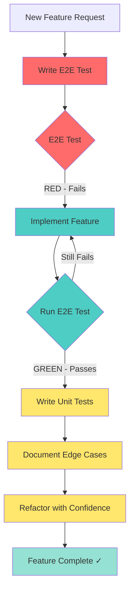

# Testing Strategy - E2E-First TDD with Test-After Unit Tests

> **Note**: This is part 3 of the split documentation. See navigation links below.

## Testing Approach

Omnera uses a **dual-timing strategy** that optimizes for both feature clarity and implementation quality:
**E2E Tests (TDD - Test-Driven Development)**:

- Write E2E tests **BEFORE** implementing features
- E2E tests serve as **executable specifications** defining feature completion
- Prevents scope creep and over-engineering
- Ensures critical user workflows are verified end-to-end
  **Unit Tests (Test-After Development)**:
- Write unit tests **AFTER** implementing features
- Unit tests document the actual solution and implementation details
- Provide fast feedback for refactoring and edge cases
- Cover internal logic, error paths, and boundary conditions
  **Why This Hybrid Approach?**

1. **E2E-First** ensures you're building the right thing (defines "what works" from user perspective)
2. **Unit-After** ensures you built it right (documents "how it works" internally)
3. **Confidence Distribution**: E2E verifies critical paths work end-to-end; unit tests enable fearless refactoring
4. **Development Flow**: E2E test → Implement until E2E passes → Add unit test coverage
   **Visual Workflow**:



**Example Workflow**:

```bash
---


## Navigation

[← Part 2](./02-overview.md) | [Part 4 →](./04-managing-red-tests-with-fixme.md)


**Parts**: [Part 1](./01-start.md) | [Part 2](./02-overview.md) | **Part 3** | [Part 4](./04-managing-red-tests-with-fixme.md) | [Part 5](./05-quick-reference-when-to-write-tests.md) | [Part 6](./06-test-file-naming-convention.md) | [Part 7](./07-testing-principles.md) | [Part 8](./08-playwright-best-practices.md) | [Part 9](./09-test-execution-strategies.md) | [Part 10](./10-best-practices-summary.md) | [Part 11](./11-anti-patterns-to-avoid.md) | [Part 12](./12-enforcement-and-code-review.md) | [Part 13](./13-references.md)
```
