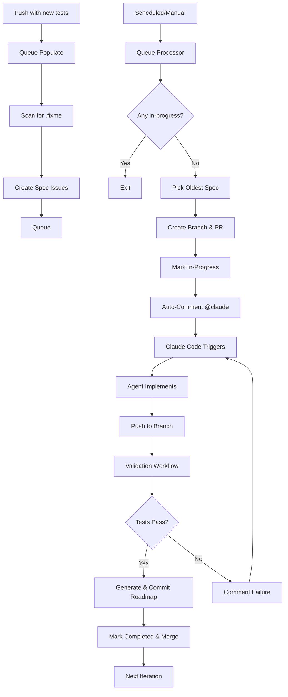

# TDD Automation Queue System Documentation

## Overview

The TDD Automation Queue System is a GitHub Actions-based pipeline that automatically implements code to make failing E2E tests pass. It uses a **queue-based architecture** where specs are processed asynchronously, one at a time, without polling or timeouts.

**Important**: The system **only processes RED tests** marked with `test.fixme()` or `it.fixme()`. Passing tests (GREEN) and skipped tests (`test.skip()`) are automatically excluded from the queue.

## Architecture



## Components

### 1. Queue Manager (`scripts/tdd-automation/queue-manager.ts`)

Core CLI tool for managing the queue:

```bash
# Scan for fixme specs and display results
bun run scripts/tdd-automation/queue-manager.ts scan

# Create issues for all fixme specs (skip duplicates)
bun run scripts/tdd-automation/queue-manager.ts populate

# Get next spec from queue (for workflows)
bun run scripts/tdd-automation/queue-manager.ts next

# Display queue status
bun run scripts/tdd-automation/queue-manager.ts status
```

**Features**:

- Extracts spec IDs from test titles (e.g., `APP-VERSION-001`)
- Checks for duplicate issues before creating
- Integrates with GitHub CLI (`gh`)
- Supports queue state management (queued, in-progress, completed, failed)

### 2. Workflows

#### **tdd-queue-populate.yml** (Scan & Queue RED Tests)

**Triggers**:

- Push to main (when new tests are added)
- Schedule (every 15 minutes)
- Manual dispatch

**Purpose**: Scans for RED tests with `test.fixme()` patterns and creates spec issues

**Important Filtering**:

- ✅ **Includes**: Tests with `test.fixme()` or `it.fixme()` (RED tests needing implementation)
- ❌ **Excludes**: Passing tests without `.fixme()` (GREEN tests already working)
- ❌ **Excludes**: Skipped tests with `test.skip()` (intentionally skipped)

**Key Steps**:

1. Scan for RED tests with `.fixme()` only
2. Check if specs need queueing
3. Create issues (skip duplicates)
4. Display queue status

#### **tdd-queue-processor.yml** (Pick & Process)

**Triggers**:

- Schedule (every 15 minutes)
- Manual dispatch

**Purpose**: Picks the next spec from the queue and prepares it for implementation

**Key Steps**:

1. Check if any spec is in-progress
2. If none, pick oldest queued spec
3. Create branch (`tdd/spec-{SPEC-ID}`)
4. Create draft PR
5. Mark issue as in-progress
6. Exit (no waiting)

**Concurrency**: Strict serial - only one spec can be in-progress at a time

#### **claude-tdd.yml** (Claude Code Implementation)

**Triggers**:

- @claude mention in issue comments (posted by queue processor every 15 min)
- Manual @claude mentions by project owner
- Manual workflow_dispatch for specific issues

**Purpose**: Automatically implements specs using dual-agent workflow with retry logic

**Key Steps**:

1. Checkout existing branch (created by queue processor)
2. **Run @agent-e2e-test-fixer**: Remove `.fixme()`, implement minimal code
3. **Run @agent-codebase-refactor-auditor**: Review quality, refactor (ALWAYS)
4. Commit changes (Claude Code account) - includes `bun run license`
5. Create PR to main with `tdd-automation` label
6. **Monitor test.yml validation** with retry loop (max 3 attempts):
   - Check test.yml CI status
   - On failure: Analyze errors, fix code, push again
   - Track retry count with labels (retry:1, retry:2, retry:3)
   - After 3 failures: Mark issue `tdd-spec:failed`, comment, exit
   - On success: Enable PR auto-merge with --squash
7. **Issue closes automatically** when PR merges to main (handled by test.yml)

**Retry Logic**:

- Max 3 attempts per spec
- Automatic error analysis and fixing
- Pipeline continues even if spec fails (doesn't block queue)

#### **test.yml** (PR Validation & Issue Closure)

**Triggers**:

- Pull request events (opened, synchronize, reopened, closed)
- Push to main branch

**Purpose**: Validates PRs and closes TDD issues when PRs merge

**Key Steps**:

1. **test job** (skip if PR closed):
   - Lint code (`bun run lint`)
   - Type check (`bun run typecheck`)
   - Run unit tests (`bun test:unit`)
   - Run E2E regression tests (`bun test:e2e:regression`)

2. **close-tdd-issue job** (only on PR merge):
   - Triggers when PR with `tdd-automation` label merges
   - Extracts issue number from PR body
   - Closes issue with reason "completed"
   - Adds label `tdd-spec:completed`
   - Removes label `tdd-spec:in-progress`

#### **tdd-queue-recovery.yml** (Timeout Recovery)

**Triggers**:

- Schedule (every 30 minutes)
- Manual dispatch

**Purpose**: Detects and recovers specs stuck in-progress with no activity

**Key Steps**:

1. Scan for specs `in-progress` > 90 minutes with no updates
2. Re-queue stuck specs (change to `queued` state)
3. Preserve retry count labels
4. Comment on issue about timeout recovery
5. **Result**: Prevents permanent pipeline blocks from stuck specs

### 3. Configuration (`.github/tdd-automation-config.yml`)

```yaml
queue:
  enabled: true
  processing_interval: 15 # minutes
  max_concurrent: 1 # strict serial processing

  populate:
    on_push: true
    on_schedule: true
    schedule_cron: '*/15 * * * *'

  issues:
    label_prefix: 'tdd-spec'
    states: [queued, in-progress, completed, failed]
    auto_close_completed: true

  validation:
    auto_validate: true
    auto_merge: true
    merge_strategy: squash
```

## How It Works

### Step 1: Queue Population

When you push new tests with `.fixme()`:

1. **Workflow triggers**: `tdd-queue-populate.yml`
2. **Scan**: `queue-manager.ts scan` finds all specs with `.fixme()`
3. **Create issues**: One minimal issue per spec ID (e.g., `APP-VERSION-001`)
4. **Skip duplicates**: Checks if issue already exists
5. **Label**: `tdd-spec:queued` + `tdd-automation`

**Issue Format**:

```markdown
## 🤖 APP-VERSION-001: should display version badge...

**File**: `specs/app/version/version.spec.ts:28`
**Branch**: `tdd/spec-APP-VERSION-001`

### For Claude Code

1. Checkout branch: `git checkout tdd/spec-APP-VERSION-001`
2. Remove `.fixme()` from test APP-VERSION-001
3. Implement minimal code to pass test
4. Commit: `fix: implement APP-VERSION-001`

Validation runs automatically on push.
```

### Step 2: Queue Processing

Every 15 minutes (or manual):

1. **Workflow triggers**: `tdd-queue-processor.yml`
2. **Check in-progress**: Query issues with `tdd-spec:in-progress` label
3. **If any exist**: Exit (strict serial - one at a time)
4. **If none**: Pick oldest issue with `tdd-spec:queued` label
5. **Create branch**: `tdd/spec-{SPEC-ID}` from main
6. **Create PR**: Draft PR linking to issue
7. **Mark in-progress**: Change label to `tdd-spec:in-progress`
8. **Auto-invoke Claude**: Post comment with `@claude` mention and implementation instructions
9. **Exit**: No waiting, queue processor is done

### Step 3: Automated Implementation (Claude Code)

**Fully automated** - triggered by `@claude` mention in auto-comment:

1. **Claude Code workflow triggers**: `claude-tdd.yml` detects `@claude` mention
2. **Checkout existing branch**: `git checkout tdd/spec-APP-VERSION-001` (already created)
3. **Run @agent-e2e-test-fixer**:
   - Read test file with spec ID
   - Remove `.fixme()` from specific test
   - Implement minimal code following architecture patterns
4. **Run @agent-codebase-refactor-auditor** (ALWAYS):
   - Review implementation quality
   - Check for code duplication
   - Ensure architectural compliance
   - Refactor and optimize as needed
5. **Commit changes**:
   - Run `bun run license` (add copyright headers)
   - Commit: `fix: implement APP-VERSION-001`
   - Push to branch
6. **Create PR**: To main with `tdd-automation` label
7. **Monitor validation**: Watch test.yml CI checks (retry up to 3 times)
8. **On success**: Enable PR auto-merge
9. **On 3 failures**: Mark issue `tdd-spec:failed`, exit

**Pipeline Mode Behavior**:

- Non-interactive (no questions to user)
- Automatic decision-making following Omnera patterns
- Minimal implementation (just enough to pass test)
- Uses Effect.ts for side effects, proper type safety

### Step 4: PR Validation & Retry

**After PR creation**, Claude Code monitors test.yml validation:

1. **Workflow triggers**: `test.yml` on pull_request events
2. **Run validations**:
   - Lint: `bun run lint`
   - Type check: `bun run typecheck`
   - Unit tests: `bun test:unit`
   - E2E regression: `bun test:e2e:regression`
3. **Claude monitors CI status**: Checks test.yml results via GitHub API
4. **On validation failure** (retry up to 3 times):
   - Claude analyzes error logs
   - Identifies root cause
   - Fixes code
   - Commits and pushes
   - Adds retry label (retry:1, retry:2, or retry:3)
   - Waits for next test.yml run
5. **On 3rd failure**:
   - Updates issue labels: remove `tdd-spec:in-progress`, add `tdd-spec:failed`
   - Comments on issue with failure summary
   - Exits (allows pipeline to continue with next spec)
6. **On success**:
   - Enables PR auto-merge: `gh pr merge --auto --squash`
   - Exits

**Result**: Failed specs (after 3 attempts) are marked but don't block the queue.

### Step 5: PR Merge & Issue Closure

**When PR merges to main**:

1. **test.yml close-tdd-issue job triggers**
2. **Extracts issue number** from PR body
3. **Closes issue** with reason "completed"
4. **Updates labels**:
   - Adds: `tdd-spec:completed`
   - Removes: `tdd-spec:in-progress`

**Result**: Issues only close when code actually merges to main.

### Step 6: Timeout Recovery

**Recovery workflow runs every 30 minutes**:

1. **Scan for stuck specs**: Find specs `in-progress` with no updates > 90 minutes
2. **Automatic re-queue**: Reset stuck specs to `queued` state (preserve retry count)
3. **Post recovery comment**: Notify about timeout and re-queue
4. **Queue continues**: Stuck specs don't permanently block the pipeline

### Step 7: Completion & Queue Progression

When validation passes and PR merges:

1. **Auto-merge enabled**: PR automatically merges to main (squash merge)
2. **Issue auto-closes**: test.yml workflow closes issue on PR merge
3. **Labels updated**: `tdd-spec:completed` added
4. **Queue progresses**: Processor picks next spec on next run (15 min)

**Timeline**: From queue → implementation → PR → merge typically 10-30 minutes per spec (depending on complexity and retry attempts)

## Labels & States

| Label                           | State       | Description                                      |
| ------------------------------- | ----------- | ------------------------------------------------ |
| `tdd-spec:queued`               | Queued      | Spec waiting to be processed                     |
| `tdd-spec:in-progress`          | In Progress | Spec being implemented (branch created)          |
| `tdd-spec:completed`            | Completed   | Spec passed validation (issue closed)            |
| `tdd-spec:failed`               | Failed      | Spec failed after 3 retries (needs human review) |
| `skip-automated`                | Skipped     | Human marked as too complex (queue skips it)     |
| `retry:1`, `retry:2`, `retry:3` | Retry Count | Tracks automatic retry attempts (max 3)          |
| `tdd-automation`                | (always)    | All TDD automation issues                        |

## CLI Commands

```bash
# Queue Management
bun run scripts/tdd-automation/queue-manager.ts scan       # Scan for fixme specs
bun run scripts/tdd-automation/queue-manager.ts populate   # Create issues
bun run scripts/tdd-automation/queue-manager.ts next       # Get next spec
bun run scripts/tdd-automation/queue-manager.ts status     # Show queue status

# Progress Tracking
bun run scripts/tdd-automation/track-progress.ts           # Generate progress dashboard

# Manual Workflow Triggers
gh workflow run tdd-queue-populate.yml                     # Populate queue
gh workflow run tdd-queue-processor.yml                    # Process next spec

# View Queue (GitHub CLI)
gh issue list --label "tdd-spec:queued"                    # Show queued specs
gh issue list --label "tdd-spec:in-progress"               # Show in-progress specs
gh issue list --label "tdd-spec:completed" --state closed  # Show completed specs
```

## Monitoring

### Progress Dashboard (`TDD-PROGRESS.md`)

Auto-generated by `track-progress.ts`:

- Overall progress (tests passing vs fixme)
- Progress by feature area
- **Queue status** (queued, in-progress, completed, failed)
- Recent activity
- Next features to fix

### Metrics File (`.github/tdd-metrics.json`)

Stores historical data:

- Test counts over time
- Queue status history
- Feature-level progress
- Recent activity log

## Best Practices

### For Manual Triggering

```bash
# Populate queue with all specs
gh workflow run tdd-queue-populate.yml

# Wait 1 minute, then process first spec
sleep 60
gh workflow run tdd-queue-processor.yml

# Check queue status
bun run scripts/tdd-automation/queue-manager.ts status
```

### For Claude Code (Automated)

**The system is fully automated** - Claude Code agents are invoked automatically via `@claude` mentions in issue comments.

**How automation works**:

1. **Queue processor creates issue**: New spec issue with `tdd-spec:queued` label
2. **Auto-comment posted**: Issue receives comment with `@claude` mention and implementation instructions
3. **Claude Code workflow triggers**: Detects `@claude` mention, starts agent
4. **Agent operates in pipeline mode**: Recognizes `tdd/spec-*` branch pattern
5. **Agent implements test**: Removes `.fixme()`, writes minimal code, commits, pushes
6. **Validation runs**: Automatic validation on push
7. **Auto-merge on success**: PR merged to main if all tests pass

**Manual intervention** (only if automation fails):

If the automated system fails or needs human review:

1. **Check the issue comments**: Look for error messages from validation
2. **Manual invocation**: Reply to issue with `@claude - Please implement spec {SPEC-ID} following the instructions above`
3. **Manual implementation**: Checkout branch `tdd/spec-{SPEC-ID}` and implement manually

**Pipeline Mode Rules** (for agents):

- ✅ **DO**: Remove `.fixme()` from single spec only
- ✅ **DO**: Implement minimal code to pass test
- ✅ **DO**: Follow domain/application/infrastructure architecture
- ✅ **DO**: Use Effect.ts for side effects
- ✅ **DO**: Run `bun run license` before committing
- ✅ **DO**: Commit with format: `fix: implement {SPEC-ID}`
- ❌ **DO NOT**: Modify multiple specs at once
- ❌ **DO NOT**: Change test logic
- ❌ **DO NOT**: Skip validation steps
- ❌ **DO NOT**: Force push

### For Debugging

```bash
# Check queue status
bun run scripts/tdd-automation/queue-manager.ts status

# View recent workflow runs
gh run list --workflow=tdd-queue-processor.yml --limit 5

# View specific spec issue
gh issue view {issue-number}

# Check validation results
gh run list --workflow=tdd-validate.yml --limit 5

# View PR for spec
gh pr list --label "tdd-automation"
```

## Troubleshooting

### No specs being processed

**Check**:

1. Are there any issues with `tdd-spec:queued`?
   ```bash
   gh issue list --label "tdd-spec:queued"
   ```
2. Is there already a spec in-progress?
   ```bash
   gh issue list --label "tdd-spec:in-progress"
   ```
3. Are workflows running?
   ```bash
   gh run list --workflow=tdd-queue-processor.yml
   ```

### Spec stuck in-progress

If a spec has been in-progress for > 90 minutes with no activity:

1. Check if PR has commits:
   ```bash
   gh pr view {pr-number} --json commits
   ```
2. Check if validation ran:
   ```bash
   gh run list --workflow=tdd-validate.yml --branch "tdd/spec-{SPEC-ID}"
   ```
3. Manually retry or reset:
   ```bash
   # Reset to queued
   gh issue edit {issue-number} --remove-label "tdd-spec:in-progress"
   gh issue edit {issue-number} --add-label "tdd-spec:queued"
   ```

### Validation failing repeatedly

1. Check validation logs:
   ```bash
   gh run view {run-id} --log
   ```
2. Clone and test locally:
   ```bash
   git checkout tdd/spec-{SPEC-ID}
   bun test:e2e {file} --grep "{SPEC-ID}"
   bun test:e2e:regression
   ```
3. Fix and push:
   ```bash
   # Make fixes
   git add -A
   git commit -m "fix: address validation failures for {SPEC-ID}"
   git push
   ```

### Queue not populating

1. Check if scan finds specs:
   ```bash
   bun run scripts/tdd-automation/queue-manager.ts scan
   ```
2. Check if test files have `.fixme()`:
   ```bash
   grep -r "test.fixme" specs/
   ```
3. Manually populate:
   ```bash
   bun run scripts/tdd-automation/queue-manager.ts populate
   ```

## Safety Features

### Rate Limiting

- **No rate limits**: Queue is stateless, no artificial limits needed
- **Natural throttling**: 15-minute processor interval + strict serial processing

### Validation Gates

- All spec tests must pass
- All regression tests must pass
- All code quality checks must pass (license, lint, typecheck)
- Human review still possible (PRs are created as draft first)

### Error Recovery

- Failed specs are labeled `tdd-spec:failed`
- Issues remain open for manual review
- No automatic retries (prevents infinite loops)
- Easy to reset: Change label back to `queued`

### Branch Protection

- All changes via PR (never direct to main)
- Auto-merge only after validation passes
- Squash merge (clean commit history)

## Configuration Options

### Adjust Processing Interval

Edit `.github/workflows/tdd-queue-processor.yml`:

```yaml
schedule:
  - cron: '*/15 * * * *' # Every 15 min (current)
  # - cron: '*/30 * * * *'  # Every 30 min (slower)
  # - cron: '*/5 * * * *'   # Every 5 min (faster)
```

### Change Concurrency

Edit `.github/tdd-automation-config.yml`:

```yaml
queue:
  max_concurrent: 1 # Strict serial (current)
  # max_concurrent: 3  # Allow 3 specs in parallel
```

Then update processor workflow to check count instead of boolean:

```yaml
# In tdd-queue-processor.yml
if [ "$IN_PROGRESS_COUNT" -lt "$MAX_CONCURRENT" ]; then
  # Process next spec
fi
```

### Disable Auto-Merge

Edit `.github/workflows/tdd-validate.yml`:

Remove or comment out the "Enable auto-merge" step.

## Cost Estimation

| Workflow        | Runs/Day           | Duration       | Cost/Day            |
| --------------- | ------------------ | -------------- | ------------------- |
| Queue Populate  | 96 (every 15 min)  | ~1 min         | $0.08               |
| Queue Processor | 96 (every 15 min)  | ~1 min         | $0.08               |
| Validation      | 10-50 (per commit) | ~5 min         | $0.40-$2.00         |
| **Total**       | **~200**           | **~10-50 min** | **$0.56-$2.16/day** |

**Note**: This excludes Claude API costs (variable, depends on implementation complexity)

## Comparison with Old System

| Metric            | Old System           | Queue System          | Improvement           |
| ----------------- | -------------------- | --------------------- | --------------------- |
| Workflow duration | 60+ min (polling)    | 1-5 min (no polling)  | **12x faster**        |
| Granularity       | Per file (~10 specs) | Per spec (1 spec)     | **10x more granular** |
| Concurrency       | Blocked by polling   | Population concurrent | **Scalable**          |
| Failure recovery  | Manual restart       | Automatic retry       | **Resilient**         |
| Cost per run      | High (long runs)     | Low (short runs)      | **10x cheaper**       |
| Visibility        | One issue per file   | One issue per spec    | **More transparent**  |

## Future Enhancements

### Planned

- [ ] Parallel processing (2-3 specs at once)
- [ ] Priority queue (high-priority specs first)
- [ ] Automatic retries (with exponential backoff)
- [ ] Slack notifications
- [ ] Cost tracking dashboard

### Experimental

- [ ] AI-powered test prioritization
- [ ] Batch processing (multiple specs in one commit)
- [ ] Cross-repository support
- [ ] Performance benchmarking

## Contributing

When updating the queue system:

1. Test with fixture tests first
2. Run manual dispatch to verify workflows
3. Monitor queue status with `status` command
4. Update this documentation
5. Update CLAUDE.md for Claude Code users

## Support

### Issues with Queue System

1. Check workflow logs: `gh run list --workflow=tdd-queue-*`
2. Check queue status: `bun run scripts/tdd-automation/queue-manager.ts status`
3. Review recent changes to workflows or scripts
4. Open issue in repo with logs and context

### Issues with Specific Spec

1. Check issue comments: `gh issue view {issue-number}`
2. Check PR status: `gh pr view {pr-number}`
3. Check validation logs: `gh run view {run-id}`
4. Test locally: `git checkout tdd/spec-{SPEC-ID} && bun test:e2e ...`

---

**Last Updated**: 2025-10-30
**Version**: 2.0.0 (Queue System)
**Status**: Active
