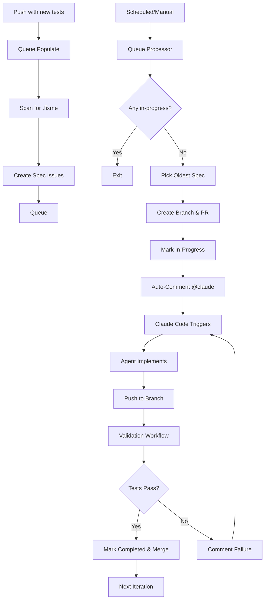

# TDD Automation Queue System Documentation

## Overview

The TDD Automation Queue System is a GitHub Actions-based pipeline that automatically implements code to make failing E2E tests pass. It uses a **queue-based architecture** where specs are processed asynchronously, one at a time, without polling or timeouts.

## Architecture



## Components

### 1. Queue Manager (`scripts/tdd-automation/queue-manager.ts`)

Core CLI tool for managing the queue:

```bash
# Scan for fixme specs and display results
bun run scripts/tdd-automation/queue-manager.ts scan

# Create issues for all fixme specs (skip duplicates)
bun run scripts/tdd-automation/queue-manager.ts populate

# Get next spec from queue (for workflows)
bun run scripts/tdd-automation/queue-manager.ts next

# Display queue status
bun run scripts/tdd-automation/queue-manager.ts status
```

**Features**:

- Extracts spec IDs from test titles (e.g., `APP-VERSION-001`)
- Checks for duplicate issues before creating
- Integrates with GitHub CLI (`gh`)
- Supports queue state management (queued, in-progress, completed, failed)

### 2. Workflows

#### **tdd-queue-populate.yml** (Scan & Queue)

**Triggers**:

- Push to main (when new tests are added)
- Schedule (every 15 minutes)
- Manual dispatch

**Purpose**: Scans for `test.fixme()` patterns and creates spec issues

**Key Steps**:

1. Scan for fixme specs
2. Check if specs need queueing
3. Create issues (skip duplicates)
4. Display queue status

#### **tdd-queue-processor.yml** (Pick & Process)

**Triggers**:

- Schedule (every 15 minutes)
- Manual dispatch

**Purpose**: Picks the next spec from the queue and prepares it for implementation

**Key Steps**:

1. Check if any spec is in-progress
2. If none, pick oldest queued spec
3. Create branch (`tdd/spec-{SPEC-ID}`)
4. Create draft PR
5. Mark issue as in-progress
6. Exit (no waiting)

**Concurrency**: Strict serial - only one spec can be in-progress at a time

#### **tdd-validate.yml** (Auto-Validation)

**Triggers**:

- Push to branches matching `tdd/spec-*`

**Purpose**: Automatically validates implementations when Claude (or anyone) pushes

**Key Steps**:

1. Extract spec ID from branch name
2. Find corresponding issue and test file
3. Run specific spec test (using grep to filter)
4. Run regression tests
5. Run code quality checks (license, lint, typecheck)
6. **On Success**:
   - Mark issue as completed
   - Close issue
   - Enable auto-merge for PR
7. **On Failure**:
   - Comment on issue with details
   - Check retry count from labels
   - If retries remaining: Re-queue spec (change to `queued` state)
   - If max retries exceeded: Mark as `failed`
   - **Queue continues**: Never blocks other specs

#### **tdd-queue-recovery.yml** (Timeout Recovery) - NEW

**Triggers**:

- Schedule (every 30 minutes)
- Manual dispatch

**Purpose**: Detects and recovers specs stuck in-progress with no activity

**Key Steps**:

1. Scan for specs `in-progress` > 2 hours with no updates
2. Re-queue stuck specs (change to `queued` state)
3. Preserve retry count labels
4. Comment on issue about timeout recovery
5. **Result**: Prevents permanent pipeline blocks from stuck specs

### 3. Configuration (`.github/tdd-automation-config.yml`)

```yaml
queue:
  enabled: true
  processing_interval: 15 # minutes
  max_concurrent: 1 # strict serial processing

  populate:
    on_push: true
    on_schedule: true
    schedule_cron: '*/15 * * * *'

  issues:
    label_prefix: 'tdd-spec'
    states: [queued, in-progress, completed, failed]
    auto_close_completed: true

  validation:
    auto_validate: true
    auto_merge: true
    merge_strategy: squash
```

## How It Works

### Step 1: Queue Population

When you push new tests with `.fixme()`:

1. **Workflow triggers**: `tdd-queue-populate.yml`
2. **Scan**: `queue-manager.ts scan` finds all specs with `.fixme()`
3. **Create issues**: One minimal issue per spec ID (e.g., `APP-VERSION-001`)
4. **Skip duplicates**: Checks if issue already exists
5. **Label**: `tdd-spec:queued` + `tdd-automation`

**Issue Format**:

```markdown
## 🤖 APP-VERSION-001: should display version badge...

**File**: `specs/app/version/version.spec.ts:28`
**Branch**: `tdd/spec-APP-VERSION-001`

### For Claude Code

1. Checkout branch: `git checkout tdd/spec-APP-VERSION-001`
2. Remove `.fixme()` from test APP-VERSION-001
3. Implement minimal code to pass test
4. Commit: `fix: implement APP-VERSION-001`

Validation runs automatically on push.
```

### Step 2: Queue Processing

Every 15 minutes (or manual):

1. **Workflow triggers**: `tdd-queue-processor.yml`
2. **Check in-progress**: Query issues with `tdd-spec:in-progress` label
3. **If any exist**: Exit (strict serial - one at a time)
4. **If none**: Pick oldest issue with `tdd-spec:queued` label
5. **Create branch**: `tdd/spec-{SPEC-ID}` from main
6. **Create PR**: Draft PR linking to issue
7. **Mark in-progress**: Change label to `tdd-spec:in-progress`
8. **Auto-invoke Claude**: Post comment with `@claude` mention and implementation instructions
9. **Exit**: No waiting, queue processor is done

### Step 3: Automated Implementation (Claude Code)

**Fully automated** - triggered by `@claude` mention in auto-comment:

1. **Claude Code workflow triggers**: Detects `@claude` mention in issue comment
2. **Agent initializes**: Recognizes `tdd/spec-*` branch pattern for pipeline mode
3. **Checkout branch**: `git checkout tdd/spec-APP-VERSION-001`
4. **Read test file**: Understands requirements from test with spec ID
5. **Remove `.fixme()`**: Makes test active
6. **Implement minimal code**: Follows domain/application/infrastructure architecture
7. **Run license headers**: `bun run license`
8. **Commit changes**: `fix: implement APP-VERSION-001`
9. **Push to branch**: Triggers validation workflow automatically

**Pipeline Mode Behavior**:

- Non-interactive (no questions to user)
- Automatic decision-making following Omnera patterns
- Minimal implementation (just enough to pass test)
- Uses Effect.ts for side effects, proper type safety

### Step 4: Auto-Validation

On every push to `tdd/spec-*` branch:

1. **Workflow triggers**: `tdd-validate.yml`
2. **Extract spec ID**: From branch name (`tdd/spec-APP-VERSION-001` → `APP-VERSION-001`)
3. **Find test file**: Grep for spec ID in `specs/`
4. **Run spec test**: `bun test:e2e {file} --grep "APP-VERSION-001"`
5. **Run regression**: `bun test:e2e:regression`
6. **Run quality checks**: `bun run license && bun run lint && bun run typecheck`
7. **Update issue**: Mark as completed (success) or handle failure with retry (fail)
8. **Auto-merge**: If all pass, enable auto-merge and mark PR as ready

### Step 5: Failure Handling & Retry (NEW)

**When validation fails** (non-blocking queue):

1. **Comment failure details**: Post failure details to issue
2. **Check retry count**: Read `retry:N` label from issue
3. **If retries remaining** (< 3 attempts):
   - Increment retry counter: Add `retry:N+1` label
   - Reset state: Change `tdd-spec:in-progress` → `tdd-spec:queued`
   - Post retry comment: Notify about automatic re-queue
   - **Queue continues**: Processor picks next spec (doesn't block)
4. **If max retries exceeded** (3 attempts):
   - Mark as failed: Change `tdd-spec:in-progress` → `tdd-spec:failed`
   - Post failure comment: Notify about manual intervention needed
   - **Queue continues**: Processor picks next spec (doesn't block)

**Result**: Failed specs never block the queue - they're either retried or marked for human review while other specs continue processing.

### Step 6: Timeout Recovery (NEW)

**Recovery workflow runs every 30 minutes**:

1. **Scan for stuck specs**: Find specs `in-progress` with no updates > 2 hours
2. **Automatic re-queue**: Reset stuck specs to `queued` state (preserve retry count)
3. **Post recovery comment**: Notify about timeout and re-queue
4. **Queue continues**: Stuck specs don't permanently block the pipeline

### Step 7: Completion

When validation passes:

1. **Issue closed**: Labeled `tdd-spec:completed`
2. **PR merged**: Auto-merged to main (squash merge)
3. **Queue progresses**: Processor picks next spec on next run (15 min)

## Labels & States

| Label                   | State        | Description                                      |
| ----------------------- | ------------ | ------------------------------------------------ |
| `tdd-spec:queued`       | Queued       | Spec waiting to be processed                     |
| `tdd-spec:in-progress`  | In Progress  | Spec being implemented (branch created)          |
| `tdd-spec:completed`    | Completed    | Spec passed validation (issue closed)            |
| `tdd-spec:failed`       | Failed       | Spec failed after 3 retries (needs human review) |
| `skip-automated`        | Skipped      | Human marked as too complex (queue skips it)     |
| `retry:1`, `retry:2`, `retry:3` | Retry Count | Tracks automatic retry attempts (max 3)  |
| `tdd-automation`        | (always)     | All TDD automation issues                        |

## CLI Commands

```bash
# Queue Management
bun run scripts/tdd-automation/queue-manager.ts scan       # Scan for fixme specs
bun run scripts/tdd-automation/queue-manager.ts populate   # Create issues
bun run scripts/tdd-automation/queue-manager.ts next       # Get next spec
bun run scripts/tdd-automation/queue-manager.ts status     # Show queue status

# Progress Tracking
bun run scripts/tdd-automation/track-progress.ts           # Generate progress dashboard

# Manual Workflow Triggers
gh workflow run tdd-queue-populate.yml                     # Populate queue
gh workflow run tdd-queue-processor.yml                    # Process next spec

# View Queue (GitHub CLI)
gh issue list --label "tdd-spec:queued"                    # Show queued specs
gh issue list --label "tdd-spec:in-progress"               # Show in-progress specs
gh issue list --label "tdd-spec:completed" --state closed  # Show completed specs
```

## Monitoring

### Progress Dashboard (`TDD-PROGRESS.md`)

Auto-generated by `track-progress.ts`:

- Overall progress (tests passing vs fixme)
- Progress by feature area
- **Queue status** (queued, in-progress, completed, failed)
- Recent activity
- Next features to fix

### Metrics File (`.github/tdd-metrics.json`)

Stores historical data:

- Test counts over time
- Queue status history
- Feature-level progress
- Recent activity log

## Best Practices

### For Manual Triggering

```bash
# Populate queue with all specs
gh workflow run tdd-queue-populate.yml

# Wait 1 minute, then process first spec
sleep 60
gh workflow run tdd-queue-processor.yml

# Check queue status
bun run scripts/tdd-automation/queue-manager.ts status
```

### For Claude Code (Automated)

**The system is fully automated** - Claude Code agents are invoked automatically via `@claude` mentions in issue comments.

**How automation works**:

1. **Queue processor creates issue**: New spec issue with `tdd-spec:queued` label
2. **Auto-comment posted**: Issue receives comment with `@claude` mention and implementation instructions
3. **Claude Code workflow triggers**: Detects `@claude` mention, starts agent
4. **Agent operates in pipeline mode**: Recognizes `tdd/spec-*` branch pattern
5. **Agent implements test**: Removes `.fixme()`, writes minimal code, commits, pushes
6. **Validation runs**: Automatic validation on push
7. **Auto-merge on success**: PR merged to main if all tests pass

**Manual intervention** (only if automation fails):

If the automated system fails or needs human review:

1. **Check the issue comments**: Look for error messages from validation
2. **Manual invocation**: Reply to issue with `@claude - Please implement spec {SPEC-ID} following the instructions above`
3. **Manual implementation**: Checkout branch `tdd/spec-{SPEC-ID}` and implement manually

**Pipeline Mode Rules** (for agents):

- ✅ **DO**: Remove `.fixme()` from single spec only
- ✅ **DO**: Implement minimal code to pass test
- ✅ **DO**: Follow domain/application/infrastructure architecture
- ✅ **DO**: Use Effect.ts for side effects
- ✅ **DO**: Run `bun run license` before committing
- ✅ **DO**: Commit with format: `fix: implement {SPEC-ID}`
- ❌ **DO NOT**: Modify multiple specs at once
- ❌ **DO NOT**: Change test logic
- ❌ **DO NOT**: Skip validation steps
- ❌ **DO NOT**: Force push

### For Debugging

```bash
# Check queue status
bun run scripts/tdd-automation/queue-manager.ts status

# View recent workflow runs
gh run list --workflow=tdd-queue-processor.yml --limit 5

# View specific spec issue
gh issue view {issue-number}

# Check validation results
gh run list --workflow=tdd-validate.yml --limit 5

# View PR for spec
gh pr list --label "tdd-automation"
```

## Troubleshooting

### No specs being processed

**Check**:

1. Are there any issues with `tdd-spec:queued`?
   ```bash
   gh issue list --label "tdd-spec:queued"
   ```
2. Is there already a spec in-progress?
   ```bash
   gh issue list --label "tdd-spec:in-progress"
   ```
3. Are workflows running?
   ```bash
   gh run list --workflow=tdd-queue-processor.yml
   ```

### Spec stuck in-progress

If a spec has been in-progress for > 2 hours with no activity:

1. Check if PR has commits:
   ```bash
   gh pr view {pr-number} --json commits
   ```
2. Check if validation ran:
   ```bash
   gh run list --workflow=tdd-validate.yml --branch "tdd/spec-{SPEC-ID}"
   ```
3. Manually retry or reset:
   ```bash
   # Reset to queued
   gh issue edit {issue-number} --remove-label "tdd-spec:in-progress"
   gh issue edit {issue-number} --add-label "tdd-spec:queued"
   ```

### Validation failing repeatedly

1. Check validation logs:
   ```bash
   gh run view {run-id} --log
   ```
2. Clone and test locally:
   ```bash
   git checkout tdd/spec-{SPEC-ID}
   bun test:e2e {file} --grep "{SPEC-ID}"
   bun test:e2e:regression
   ```
3. Fix and push:
   ```bash
   # Make fixes
   git add -A
   git commit -m "fix: address validation failures for {SPEC-ID}"
   git push
   ```

### Queue not populating

1. Check if scan finds specs:
   ```bash
   bun run scripts/tdd-automation/queue-manager.ts scan
   ```
2. Check if test files have `.fixme()`:
   ```bash
   grep -r "test.fixme" specs/
   ```
3. Manually populate:
   ```bash
   bun run scripts/tdd-automation/queue-manager.ts populate
   ```

## Safety Features

### Rate Limiting

- **No rate limits**: Queue is stateless, no artificial limits needed
- **Natural throttling**: 15-minute processor interval + strict serial processing

### Validation Gates

- All spec tests must pass
- All regression tests must pass
- All code quality checks must pass (license, lint, typecheck)
- Human review still possible (PRs are created as draft first)

### Error Recovery

- Failed specs are labeled `tdd-spec:failed`
- Issues remain open for manual review
- No automatic retries (prevents infinite loops)
- Easy to reset: Change label back to `queued`

### Branch Protection

- All changes via PR (never direct to main)
- Auto-merge only after validation passes
- Squash merge (clean commit history)

## Configuration Options

### Adjust Processing Interval

Edit `.github/workflows/tdd-queue-processor.yml`:

```yaml
schedule:
  - cron: '*/15 * * * *' # Every 15 min (current)
  # - cron: '*/30 * * * *'  # Every 30 min (slower)
  # - cron: '*/5 * * * *'   # Every 5 min (faster)
```

### Change Concurrency

Edit `.github/tdd-automation-config.yml`:

```yaml
queue:
  max_concurrent: 1 # Strict serial (current)
  # max_concurrent: 3  # Allow 3 specs in parallel
```

Then update processor workflow to check count instead of boolean:

```yaml
# In tdd-queue-processor.yml
if [ "$IN_PROGRESS_COUNT" -lt "$MAX_CONCURRENT" ]; then
  # Process next spec
fi
```

### Disable Auto-Merge

Edit `.github/workflows/tdd-validate.yml`:

Remove or comment out the "Enable auto-merge" step.

## Cost Estimation

| Workflow        | Runs/Day           | Duration       | Cost/Day            |
| --------------- | ------------------ | -------------- | ------------------- |
| Queue Populate  | 96 (every 15 min)  | ~1 min         | $0.08               |
| Queue Processor | 96 (every 15 min)  | ~1 min         | $0.08               |
| Validation      | 10-50 (per commit) | ~5 min         | $0.40-$2.00         |
| **Total**       | **~200**           | **~10-50 min** | **$0.56-$2.16/day** |

**Note**: This excludes Claude API costs (variable, depends on implementation complexity)

## Comparison with Old System

| Metric            | Old System           | Queue System          | Improvement           |
| ----------------- | -------------------- | --------------------- | --------------------- |
| Workflow duration | 60+ min (polling)    | 1-5 min (no polling)  | **12x faster**        |
| Granularity       | Per file (~10 specs) | Per spec (1 spec)     | **10x more granular** |
| Concurrency       | Blocked by polling   | Population concurrent | **Scalable**          |
| Failure recovery  | Manual restart       | Automatic retry       | **Resilient**         |
| Cost per run      | High (long runs)     | Low (short runs)      | **10x cheaper**       |
| Visibility        | One issue per file   | One issue per spec    | **More transparent**  |

## Future Enhancements

### Planned

- [ ] Parallel processing (2-3 specs at once)
- [ ] Priority queue (high-priority specs first)
- [ ] Automatic retries (with exponential backoff)
- [ ] Slack notifications
- [ ] Cost tracking dashboard

### Experimental

- [ ] AI-powered test prioritization
- [ ] Batch processing (multiple specs in one commit)
- [ ] Cross-repository support
- [ ] Performance benchmarking

## Contributing

When updating the queue system:

1. Test with fixture tests first
2. Run manual dispatch to verify workflows
3. Monitor queue status with `status` command
4. Update this documentation
5. Update CLAUDE.md for Claude Code users

## Support

### Issues with Queue System

1. Check workflow logs: `gh run list --workflow=tdd-queue-*`
2. Check queue status: `bun run scripts/tdd-automation/queue-manager.ts status`
3. Review recent changes to workflows or scripts
4. Open issue in repo with logs and context

### Issues with Specific Spec

1. Check issue comments: `gh issue view {issue-number}`
2. Check PR status: `gh pr view {pr-number}`
3. Check validation logs: `gh run view {run-id}`
4. Test locally: `git checkout tdd/spec-{SPEC-ID} && bun test:e2e ...`

---

**Last Updated**: 2025-10-30
**Version**: 2.0.0 (Queue System)
**Status**: Active
