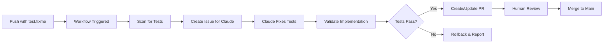

# TDD Automation Pipeline Documentation

## Overview

The TDD Automation Pipeline is a GitHub Actions-based system that automatically implements code to make failing E2E tests pass. It uses Claude Code's GitHub integration to invoke specialized agents that fix tests, refactor code, and create pull requests.

## How It Works



## Quick Start

### 1. Manual Trigger (Recommended for Testing)

```bash
# Trigger the pipeline manually via GitHub UI
1. Go to Actions tab
2. Select "TDD Auto-Fix Pipeline"
3. Click "Run workflow"
4. Configure options:
   - Feature area: auto (or specific like app/version)
   - Max tests: 3 (start small)
   - Dry run: true (for testing)
```

### 2. Scheduled Runs (Production)

Uncomment the schedule in `.github/workflows/tdd-auto-fix.yml`:

```yaml
on:
  schedule:
    - cron: '0 2 * * *' # Daily at 2 AM UTC
```

## Pipeline Components

### Workflows

1. **`.github/workflows/tdd-auto-fix.yml`**
   - Main orchestrator workflow
   - Scans for test.fixme patterns
   - Creates issues and PRs for Claude Code
   - Validates implementations

2. **`.github/workflows/tdd-auto-refactor.yml`**
   - Triggered after tests are fixed
   - Invokes codebase-refactor-auditor agent
   - Optimizes and cleans up code

### Configuration

**`.github/tdd-automation-config.yml`**

Key settings:

- `max_tests_per_run`: 3 (default)
- `max_daily_runs`: 5
- `cooldown_minutes`: 30
- `rollout.phase`: testing/limited/full

### Utility Scripts

Located in `scripts/tdd-automation/`:

- **`scan-fixme-tests.ts`** - Finds and prioritizes test.fixme patterns
- **`track-progress.ts`** - Generates metrics and progress dashboard
- **`validate-implementation.ts`** - Runs tests and quality checks

### Agent Prompts

Located in `scripts/tdd-automation/prompts/`:

- **`e2e-test-fixer.md`** - Instructions for test fixing agent
- **`codebase-refactor-auditor.md`** - Instructions for refactoring agent

## Testing the Pipeline

### Step 1: Test with Fixture

We've created a simple fixture for testing:

```bash
# Location: specs/tdd-automation/fixtures/simple-feature.spec.ts
# Contains: 8 simple test.fixme patterns (calculator and todo list)

# Run scan to verify detection
bun run scripts/tdd-automation/scan-fixme-tests.ts

# Should show the fixture tests in results
```

### Step 2: Dry Run Mode

1. Set `dry_run: true` in workflow dispatch
2. This creates draft PRs only
3. Claude Code will still process the issue
4. No auto-merge occurs

### Step 3: Monitor Progress

```bash
# Check scan results
cat .github/tdd-scan-results.json

# Track progress
bun run scripts/tdd-automation/track-progress.ts

# View dashboard
cat TDD-PROGRESS.md
```

## How Claude Code Integration Works

### Issue Creation

The workflow creates an issue with `@claude` mention:

```markdown
## Instructions for @claude

Please follow these steps to fix the failing tests:

1. Checkout the branch: `git checkout tdd/auto-fix-{feature}`
2. Run the e2e-test-fixer agent (Task tool with subagent_type="e2e-test-fixer")
3. Validate implementation
4. Commit changes
```

### Agent Invocation

Claude Code reads the issue and:

1. Checks out the specified branch
2. Invokes the e2e-test-fixer agent
3. Implements minimal code to pass tests
4. Commits with conventional message
5. Reports progress in the issue

### PR Management

The workflow:

1. Creates a PR with detailed instructions
2. Waits for Claude to commit changes
3. Validates the implementation
4. Updates PR with results
5. Applies appropriate labels

## Safety Mechanisms

### Rate Limiting

- Max 5 runs per day
- 30-minute cooldown between runs
- Max 3 tests fixed per run

### Validation Gates

- All modified tests must pass
- Regression tests must pass
- ESLint and TypeScript must pass
- Human review required for merge

### Rollback on Failure

- Automatic rollback if tests fail
- Creates issue documenting failure
- Preserves failed branch for analysis

### Branch Protection

- No direct commits to main
- All changes via PR
- Required reviews before merge

## Monitoring

### Progress Dashboard

Generated at `TDD-PROGRESS.md`:

```markdown
## 📊 Overall Progress

Progress: ████████░░░░░░░░░░░░ 40% (714/1785 tests)

## 📈 Progress by Feature Area

| Feature     | Progress | Tests Fixed | Remaining |
| ----------- | -------- | ----------- | --------- |
| app/version | 100%     | 3/3         | 0         |
| app/name    | 67%      | 2/3         | 1         |
```

### Metrics Collection

Stored in `.github/tdd-metrics.json`:

- Run history
- Success rates
- Average time per test
- Cost tracking (estimated)

## Troubleshooting

### Pipeline Not Starting

```bash
# Check rate limits
gh run list --workflow=tdd-auto-fix.yml --json createdAt

# Check for existing PRs
gh pr list --label tdd-automation
```

### Claude Not Processing Issue

1. Verify `CLAUDE_CODE_OAUTH_TOKEN` is set in secrets
2. Check Claude Code app is installed on repo
3. Ensure issue has `@claude` mention
4. Check Claude Code dashboard for quota

### Tests Failing After Implementation

1. Check workflow logs for details
2. Review generated code in PR
3. Manually run tests locally:
   ```bash
   git checkout tdd/auto-fix-{branch}
   bun test:e2e {test-file}
   ```

### Rollback Occurred

1. Check issue created by rollback
2. Review branch `tdd/failed-{feature}`
3. Manually fix and retry

## Best Practices

### Start Small

1. Begin with simple features (app/version, app/name)
2. Use dry run mode initially
3. Fix 1-3 tests per run maximum

### Monitor Closely

1. Watch first few runs carefully
2. Review generated code quality
3. Track metrics and adjust parameters

### Progressive Rollout

1. **Testing Phase**: Use fixtures, dry run
2. **Limited Phase**: 1-2 feature areas
3. **Full Phase**: All features, scheduled runs

## Configuration Examples

### Conservative Settings

```yaml
pipeline:
  max_tests_per_run: 1
  max_daily_runs: 2
  cooldown_minutes: 60

rollout:
  phase: testing
```

### Aggressive Settings

```yaml
pipeline:
  max_tests_per_run: 5
  max_daily_runs: 10
  cooldown_minutes: 15

rollout:
  phase: full
```

### Feature-Specific Settings

```yaml
feature_areas:
  - pattern: 'api/paths/auth/**/*.spec.ts'
    priority: 5
    max_tests_per_run: 1 # Auth is sensitive
    require_human_approval: true
```

## Cost Estimation

Based on Claude API usage:

| Tests/Day | Estimated Cost/Day | Cost/Month |
| --------- | ------------------ | ---------- |
| 5         | $2-3               | $60-90     |
| 15        | $6-9               | $180-270   |
| 30        | $12-18             | $360-540   |

Factors affecting cost:

- Complexity of tests
- Amount of code needed
- Number of retries
- Refactoring frequency

## Future Enhancements

### Planned Features

1. Parallel test fixing (multiple files)
2. ML-based test prioritization
3. Auto-merge on high confidence
4. Cross-repository support

### Integration Ideas

1. Slack notifications
2. JIRA ticket creation
3. Automatic release notes
4. Performance tracking

## Security Considerations

### Token Management

- Rotate `CLAUDE_CODE_OAUTH_TOKEN` monthly
- Use repository secrets (never commit)
- Limit token scope to minimum required

### Code Review

- Always require human review
- Use CODEOWNERS for sensitive areas
- Enable branch protection rules

### Audit Trail

- All changes tracked in git
- Issues document agent interactions
- PR descriptions include full context

## Support

### Getting Help

1. Check this documentation
2. Review workflow logs
3. Check Claude Code status
4. Open issue in repo

### Contributing

1. Test changes with fixtures first
2. Update documentation
3. Follow conventional commits
4. Add tests for new features

## Quick Reference

### Commands

```bash
# Manual scan for tests
bun run scripts/tdd-automation/scan-fixme-tests.ts

# Track progress
bun run scripts/tdd-automation/track-progress.ts

# Validate specific test file
bun run scripts/tdd-automation/validate-implementation.ts specs/app/version/version.spec.ts

# Trigger workflow via CLI
gh workflow run tdd-auto-fix.yml \
  -f feature_area=app/version \
  -f max_tests=3 \
  -f dry_run=true

# View recent runs
gh run list --workflow=tdd-auto-fix.yml

# Check PR status
gh pr list --label tdd-automation
```

### File Locations

```
.github/
├── workflows/
│   ├── tdd-auto-fix.yml          # Main pipeline
│   └── tdd-auto-refactor.yml     # Refactoring pipeline
├── tdd-automation-config.yml     # Configuration
├── tdd-scan-results.json         # Latest scan results
├── tdd-metrics.json              # Historical metrics
└── ISSUE_TEMPLATE/
    └── tdd-auto-fix.md           # Issue template

scripts/tdd-automation/
├── scan-fixme-tests.ts           # Scanner utility
├── track-progress.ts             # Progress tracker
├── validate-implementation.ts    # Validator
└── prompts/
    ├── e2e-test-fixer.md        # Agent prompt
    └── codebase-refactor-auditor.md

specs/tdd-automation/
└── fixtures/
    └── simple-feature.spec.ts    # Test fixture

TDD-PROGRESS.md                    # Progress dashboard
```

## Conclusion

The TDD Automation Pipeline transforms your development workflow by automatically implementing code to pass failing tests. Start with the test fixtures, gradually expand to real features, and monitor the results. With proper configuration and monitoring, you can achieve continuous automated development while maintaining code quality and safety.
