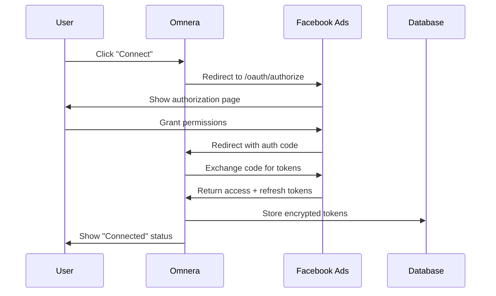

# Facebook Ads Connection - Business Rules

## Overview

OAuth 2.0 integration with Facebook Ads, enabling access to Facebook Ads bases, tables, records, and webhooks. Facebook Ads is a cloud-based spreadsheet-database hybrid platform used for project management, CRM, and data organization.

## Use Cases

- **Data Sync**: Sync records between Omnera tables and Facebook Ads bases
- **Automation Triggers**: React to new/updated records in Facebook Ads
- **Webhook Integration**: Subscribe to Facebook Ads webhook events
- **API Actions**: Create, read, update, delete records via Facebook Ads API

## Connection Schema

### Required Properties

| Property       | Type                 | Description                         |
| -------------- | -------------------- | ----------------------------------- |
| `type`         | const "facebook-ads" | Service discriminator               |
| `id`           | integer              | Unique connection identifier        |
| `name`         | string (1-100 chars) | Human-readable label                |
| `clientId`     | string               | OAuth 2.0 client identifier         |
| `clientSecret` | string               | OAuth 2.0 client secret (encrypted) |

### Example Configuration

```json
{
  "type": "facebook-ads",
  "id": 1,
  "name": "Marketing Facebook Ads Workspace",
  "clientId": "facebook-ads_client_xyz789",
  "clientSecret": "secret_facebook-ads_abc123"
}
```

## OAuth Setup Guide

### 1. Create OAuth Integration in Facebook Ads

1. Navigate to [Facebook Ads Developer Hub](https://facebook-ads.com/developers)
2. Click "Create OAuth Integration"
3. Fill in integration details:
   - **Name**: Omnera Integration
   - **Redirect URI**: `https://yourdomain.com/oauth/facebook-ads/callback`
   - **Scopes**: Select required permissions (e.g., `data.records:read`, `data.records:write`)
4. Copy **Client ID** and **Client Secret**

### 2. Configure Connection in Omnera

1. Go to Settings > Connections
2. Click "Add Connection" > "Facebook Ads"
3. Paste Client ID and Client Secret
4. Set connection name (e.g., "Marketing Facebook Ads")
5. Click "Save"

### 3. Connect via OAuth Flow

1. Click "Connect" button next to saved connection
2. Redirected to Facebook Ads authorization page
3. Grant requested permissions
4. Redirected back to Omnera
5. Connection status changes to "Connected"

## Runtime Behavior

### OAuth Flow Lifecycle



### Token Management

- **Access Token**: Short-lived (1 hour), used for API requests
- **Refresh Token**: Long-lived (90 days), used to obtain new access tokens
- **Auto-Refresh**: System automatically refreshes expired access tokens
- **Encryption**: All tokens encrypted at rest using AES-256

### Connection States

| State          | Description                      | User Actions                   |
| -------------- | -------------------------------- | ------------------------------ |
| `configured`   | Credentials saved, not connected | Connect                        |
| `connected`    | OAuth completed, tokens valid    | Disconnect, Test               |
| `disconnected` | Manually disconnected            | Re-connect                     |
| `error`        | OAuth failed or tokens revoked   | Update credentials, Re-connect |

## API Capabilities

### Supported Operations

- **List Bases**: Retrieve all accessible Facebook Ads bases
- **List Tables**: Get tables within a base
- **Query Records**: Filter, sort, paginate records
- **Create Record**: Insert new record with field values
- **Update Record**: Modify existing record fields
- **Delete Record**: Remove record from table
- **Webhooks**: Subscribe to record changes

### Example API Call (via Omnera)

```typescript
// Automation action: Create Facebook Ads record
{
  "action": "facebook-ads.createRecord",
  "connection": 1,  // Connection ID
  "config": {
    "baseId": "appABC123",
    "tableId": "tblDEF456",
    "fields": {
      "Name": "John Doe",
      "Email": "john@example.com",
      "Status": "Active"
    }
  }
}
```

## Security Best Practices

### Credentials Storage

- Client Secret MUST be encrypted before database storage
- Never expose Client Secret in API responses (mask as `***`)
- Use separate OAuth apps for dev/staging/production environments

### Permission Scopes

Request only necessary scopes:

- **Read-only**: `data.records:read`, `schema.bases:read`
- **Write access**: Add `data.records:write`
- **Webhooks**: Add `webhook:manage`

### Token Security

- Store access/refresh tokens encrypted
- Rotate refresh tokens on security events
- Revoke tokens immediately on connection deletion
- Monitor for unusual API activity

## Error Scenarios

### OAuth Authorization Failed

**Cause**: User denied permissions or invalid client credentials
**Resolution**: Verify Client ID/Secret, retry connection flow

### Token Expired

**Cause**: Access token expired and refresh failed
**Resolution**: System auto-refreshes; if refresh fails, user must re-connect

### API Rate Limit

**Cause**: Exceeded Facebook Ads API rate limits (5 requests/second)
**Resolution**: Implement exponential backoff, queue requests

### Webhook Payload Delivery Failed

**Cause**: Omnera webhook endpoint unreachable
**Resolution**: Facebook Ads retries up to 3 times; check endpoint availability

## Testing Specifications

See `specs` array in schema for E2E test scenarios covering:

- Connection creation with valid credentials
- Validation of invalid credentials
- Connection name updates

Run tests: `bun test:e2e --grep="CONN-FACEBOOK_ADS"`

## Related Resources

- [Facebook Ads OAuth Documentation](https://facebook-ads.com/developers/web/api/oauth-reference)
- [Facebook Ads API Reference](https://facebook-ads.com/developers/web/api/introduction)
- [Omnera Connection Management Guide](../../../admin/connections/README.md)
